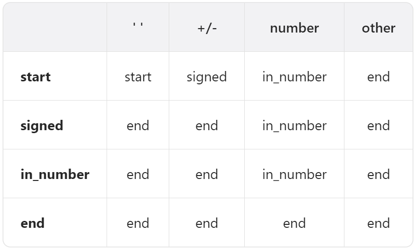

# 模拟

## 题目

### 字符串相加

https://leetcode.cn/problems/add-strings

```c++
class Solution {
public:
    string addStrings(string num1, string num2) {
        int i1 = num1.size() - 1;
        int i2 = num2.size() - 1;
        int carry = 0;
        string res;
        while (i1 >= 0 || i2 >= 0 || carry) {
            int val = carry;
            if (i1 >= 0) {
                val += num1[i1--] - '0';
            }
            if (i2 >= 0) {
                val += num2[i2--] - '0';
            }
            res.push_back((char) (48 + val % 10));
            carry = val / 10;
        }
        reverse(res.begin(), res.end());
        return res;
    }
};
```

时间复杂度：$O\left ( \max \left ( M,N \right )  \right ) $

空间复杂度：$O\left (1\right ) $

### 螺旋矩阵

https://leetcode.cn/problems/spiral-matrix

不要关注局部位置怎么变，应该设计宏观调度过程。设计一个 `getFrame` 函数，接收左上点的坐标，打印出一个边框，主函数不断调用 `getFrame` 函数即可。

模拟：

```c++
class Solution {
public:
    vector<int> spiralOrder(vector<vector<int>>& matrix) {
        int M = matrix.size();
        int N = matrix[0].size();
        vector<int> res(M * N);
        for (int start = 0; start < ((min(M, N) + 1) >> 1); ++start) {
            getFrame(matrix, start, res);
        }
        return res;
    }

    void getFrame(vector<vector<int>>& matrix, int start, vector<int>& res) {
        int M = matrix.size();
        int N = matrix[0].size();
        int end1 = M - 1 - start;
        int end2 = N - 1 - start;
        int index = 2 * start * (M + N - 2 * start);
        if (start == end1) {
            for (int j = start; j <= end2; j++) {
                res[index++] = matrix[start][j];
            }
        } else if (start == end2) {
            for (int i = start; i <= end1; i++) {
                res[index++] = matrix[i][start];
            }
        } else {
            for (int j = start; j < end2; j++) {
                res[index++] = matrix[start][j];
            }
            for (int i = start; i < end1; i++) {
                res[index++] = matrix[i][end2];
            }
            for (int j = end2; j > start; j--) {
                res[index++] = matrix[end1][j];
            }
            for (int i = end1; i > start; i--) {
                res[index++] = matrix[i][start];
            }
        }
    }
};
```

时间复杂度：$O\left(MN\right)$

空间复杂度：$O\left(1\right)$

### 旋转图像

https://leetcode.cn/problems/rotate-image

模拟 1：

```c++
class Solution {
public:
    void rotate(vector<vector<int>>& matrix) {
        int N = matrix.size();
        int timesRotate = N >> 1;
        for (int start = 0; start < timesRotate; ++start) {
            rotateFrame(matrix, start);
        }
    }

    void rotateFrame(vector<vector<int>>& matrix, int start) {
        int N = matrix.size();
        int end = N - 1 - start;
        for (int i = 0; i < end - start; ++i) {
            int temp = matrix[start][start + i];
            matrix[start][start + i] = matrix[end - i][start];
            matrix[end - i][start] = matrix[end][end - i];
            matrix[end][end - i] = matrix[start + i][end];
            matrix[start + i][end] = temp;
        }
    }
};
```

时间复杂度：$O\left(N^2\right)$

空间复杂度：$O\left(1\right)$

------

模拟 2：

先沿水平方向翻转再沿主对角线翻转。即 `M[i][j] -> M[N - 1 - i][j] -> M[j][N - 1 - i]`，`M[i][j] -> M[j][N - 1 - i]` 就是顺时针旋转 90° 的结果。

```c++
class Solution {
public:
    void rotate(vector<vector<int>>& matrix) {
        int N = matrix.size();
        for (int i = 0; i < (N >> 1); ++i) {
            for (int j = 0; j < N; ++j) {
                swap(matrix[i][j], matrix[N - 1 - i][j]);
            }
        }
        for (int i = 0; i < N; ++i) {
            for (int j = 0; j < i; ++j) {
                swap(matrix[i][j], matrix[j][i]);
            }
        }
    }
};
```

时间复杂度：$O\left(N^2\right)$

空间复杂度：$O\left(1\right)$

### 汉明距离

https://leetcode.cn/problems/hamming-distance

模拟 1：

```c++
class Solution {
public:
    int hammingDistance(int x, int y) {
        int xor_ = x ^ y;
        int res = 0;
        while (xor_) {
            res += xor_ & 1;
            xor_ >>= 1;
        }
        return res;
    }
};
```

时间复杂度：$O\left(1\right)$

空间复杂度：$O\left(1\right)$

------

模拟 2（内置函数）：

```c++
class Solution {
public:
    int hammingDistance(int x, int y) {
        return __builtin_popcount(x ^ y);
    }
};
```

时间复杂度：$O\left(1\right)$

空间复杂度：$O\left(1\right)$

------

模拟 3（Brian Kernighan 算法）：

进行 `xor_ &= xor_ - 1` 这个操作之后，`xor_` 最右侧的 1 变成了 0。

```c++
class Solution {
public:
    int hammingDistance(int x, int y) {
        int xor_ = x ^ y;
        int res = 0;
        while (xor_) {
            xor_ &= xor_ - 1;
            ++res;
        }
        return res;
    }
};
```

时间复杂度：$O\left(1\right)$

空间复杂度：$O\left(1\right)$

### 矩阵置零

https://leetcode.cn/problems/set-matrix-zeroes

模拟 1：

```c++
class Solution {
public:
    void setZeroes(vector<vector<int>>& matrix) {
        int M = matrix.size();
        int N = matrix[0].size();
        vector<bool> rows(M);
        vector<bool> cols(N);

        for (int i = 0; i < M; ++i) {
            for (int j = 0; j < N; ++j) {
                if (!matrix[i][j]) {
                    rows[i] = true;
                    cols[j] = true;
                }
            }
        }

        for (int i = 0; i < M; ++i) {
            for (int j = 0; j < N; ++j) {
                if (rows[i] || cols[j]) {
                    matrix[i][j] = 0;
                }
            }
        }
    }
};
```

时间复杂度：$O\left(MN\right)$

空间复杂度：$O\left(M+N\right)$

------

模拟 2：

使用 `row0` 和 `col0` 这两个变量记录第 0 行和第 0 列上是否有 0，然后使用第 0 行和第 0 列的空间（利用已有数据结构的空间）记录第 `i` 行和第 `j` 列是否需要置零。

```c++
class Solution {
public:
    void setZeroes(vector<vector<int>>& matrix) {
        int M = matrix.size();
        int N = matrix[0].size();
        bool row0 = false;
        bool col0 = false;

        for (int i = 0; i < M; ++i) {
            if (!matrix[i][0]) {
                col0 = true;
                break;
            }
        }
        for (int j = 0; j < N; ++j) {
            if (!matrix[0][j]) {
                row0 = true;
                break;
            }
        }

        for (int i = 1; i < M; ++i) {
            for (int j = 1; j < N; ++j) {
                if (!matrix[i][j]) {
                    matrix[0][j] = 0;
                    matrix[i][0] = 0;
                }
            }
        }

        for (int i = 1; i < M; ++i) {
            for (int j = 1; j < N; ++j) {
                if (!matrix[0][j] || !matrix[i][0]) {
                    matrix[i][j] = 0;
                }
            }
        }

        if (row0) {
            for (int j = 0; j < N; ++j) {
                matrix[0][j] = 0;
            }
        }
        if (col0) {
            for (int i = 0; i < M; ++i) {
                matrix[i][0] = 0;
            }
        }
    }
};
```

时间复杂度：$O\left(MN\right)$

空间复杂度：$O\left(1\right)$

------

模拟 3：

可以再节省 `row0` 这个变量，用 `matrix[0][0]` 来表示第 0 行元素是否需要置零。

```c++
class Solution {
public:
    void setZeroes(vector<vector<int>>& matrix) {
        int M = matrix.size();
        int N = matrix[0].size();
        bool col0 = false;

        for (int i = 0; i < M; ++i) {
            if (!matrix[i][0]) {
                col0 = true;
                break;
            }
        }
        for (int j = 0; j < N; ++j) {
            if (!matrix[0][j]) {
                matrix[0][0] = 0;
                break;
            }
        }

        for (int i = 1; i < M; ++i) {
            for (int j = 1; j < N; ++j) {
                if (!matrix[i][j]) {
                    matrix[0][j] = 0;
                    matrix[i][0] = 0;
                }
            }
        }

        for (int i = 1; i < M; ++i) {
            for (int j = 1; j < N; ++j) {
                if (!matrix[0][j] || !matrix[i][0]) {
                    matrix[i][j] = 0;
                }
            }
        }

        if (!matrix[0][0]) {
            for (int j = 0; j < N; ++j) {
                matrix[0][j] = 0;
            }
        }
        if (col0) {
            for (int i = 0; i < M; ++i) {
                matrix[i][0] = 0;
            }
        }
    }
};
```

时间复杂度：$O\left(MN\right)$

空间复杂度：$O\left(1\right)$

### Jump Game

https://leetcode.com/problems/jump-game

**Simulation.**

```c++
class Solution {
public:
    bool canJump(vector<int>& nums) {
        int n = nums.size();
        int maxIndex = 0;  // Currently the farthest reachable index.
        for (int i = 0; i < n; ++i) {
            if (i > maxIndex) {
                return false;
            }
            maxIndex = max(maxIndex, i + nums[i]);
            if (maxIndex >= n - 1) {
                return true;
            }
        }
        return true;
    }
};
```

Time Complexity: $O\left(n\right)$, where $n$ is the length of the array.

Space Complexity: $O\left(1\right)$.

### Rotate Array

https://leetcode.cn/problems/rotate-array

**Reverse.**

```c++
class Solution {
public:
    void rotate(vector<int>& nums, int k) {
        reverse(nums.begin(), nums.end());
        int n = nums.size();
        k %= n;
        reverse(nums.begin(), nums.begin() + k);
        reverse(nums.begin() + k, nums.end());
    }
};
```

Time Complexity: $O\left(n\right)$, where $n$ is the length of the array.

Space Complexity: $O\left(1\right)$.

### 整数反转

https://leetcode.cn/problems/reverse-integer

题解：https://leetcode.cn/problems/reverse-integer/solutions/211865/tu-jie-7-zheng-shu-fan-zhuan-by-wang_ni_ma

下图中，绿色的是最大 32 位整数。第二排数字中，橘子的是 5，它是大于上面同位置的 4，这就意味着 5 后跟任何数字，都会比最大 32 位整数都大。所以，我们到【最大数的 1/10】时，就要开始判断了。如果某个数字大于 214748364 那后面就不用再判断了，肯定溢出了。如果某个数字等于 214748364 ，这对应到上图中第三、第四、第五排的数字，需要要跟最大数的末尾数字比较，如果这个数字比 7 还大，说明溢出了。负数同理。


```c++
class Solution {
public:
    int reverse(int x) {
        const int NEGATIVE_COMP = INT_MIN / 10;
        const int POSITIVE_COMP = INT_MAX / 10;
        const int NEGATIVE_LAST_BIT = -INT_MIN % 10;
        const int POSITIVE_LAST_BIT = INT_MAX % 10;
        int res = 0;
        while (x != 0) {
            int lastBit = x % 10;
            if ((res > POSITIVE_COMP ||
                 res == POSITIVE_COMP && lastBit > POSITIVE_LAST_BIT) ||
                (res < NEGATIVE_COMP ||
                 res == NEGATIVE_COMP && lastBit < NEGATIVE_LAST_BIT)) {
                return 0;
            }
            res = 10 * res + lastBit;
            x /= 10;
        }
        return res;
    }
};
```

时间复杂度：$O\left(1\right)$

空间复杂度：$O\left(1\right)$

### 字符串转换整数 (atoi)

https://leetcode.cn/problems/string-to-integer-atoi

自动机：




```c++
class Automation {
    string state = "start";
    unordered_map<string, vector<string>> table = {
        {"start", {"start", "signed", "in_number", "end"}},
        {"signed", {"end", "end", "in_number", "end"}},
        {"in_number", {"end", "end", "in_number", "end"}},
        {"end", {"end", "end", "end", "end"}}};
    int sign = 1;
    long long val = 0;  // >= 0

public:
    int getCol(char& c) {
        if (isspace(c)) {
            return 0;
        } else if (c == '+' || c == '-') {
            return 1;
        } else if (isdigit(c)) {
            return 2;
        } else {
            return 3;
        }
    }

    void step(char& c) {
        state = table[state][getCol(c)];
        if (state == "in_number") {
            val = 10 * val + c - '0';
            val = sign == 1 ? min(val, (long long)INT_MAX)
                            : min(val, -(long long)INT_MIN);
        } else if (state == "signed") {
            sign = c == '+' ? 1 : -1;
        }
    }

    int getRes() {
        return sign * val;
    }
};

class Solution {
public:
    int myAtoi(string s) {
        Automation automation;
        for (char& c : s) {
            automation.step(c);
        }
        return automation.getRes();
    }
};
```

时间复杂度：$O\left(n\right)$，$n$ 是字符串的长度

空间复杂度：$O\left(1\right)$

### 除自身以外数组的乘积

https://leetcode.cn/problems/product-of-array-except-self

方法一：

事先准备好前缀和后缀乘积的数组。

```c++
class Solution {
public:
    vector<int> productExceptSelf(vector<int>& nums) {
        int n = nums.size();
        vector<int> prefixProducts(n, 1);
        vector<int> suffixProducts(n, 1);
        for (int i = 1; i < n; ++i) {
            prefixProducts[i] = nums[i - 1] * prefixProducts[i - 1];
        }
        for (int i = n - 2; i >= 0; --i) {
            suffixProducts[i] = nums[i + 1] * suffixProducts[i + 1];
        }

        vector<int> res(n);
        for (int i = 0; i < n; ++i) {
            res[i] = prefixProducts[i] * suffixProducts[i];
        }
        return res;
    }
};
```

时间复杂度：$O\left(n\right)$

空间复杂度：$O\left(n\right)$

方法二：

复用 `res` 数组。

```c++
class Solution {
public:
    vector<int> productExceptSelf(vector<int>& nums) {
        int n = nums.size();
        vector<int> res(n, 1);
        for (int i = 1; i < n; ++i) {
            res[i] = nums[i - 1] * res[i - 1];
        }
        int temp = 1;
        for (int i = n - 1; i >= 0; --i) {
            res[i] *= temp;
            temp *= nums[i];
        }
        return res;
    }
};
```

时间复杂度：$O\left(n\right)$

空间复杂度：$O\left(1\right)$

方法三：

双指针。

```c++
class Solution {
public:
    vector<int> productExceptSelf(vector<int>& nums) {
        int n = nums.size();
        vector<int> res(n, 1);
        int prefixProduct = 1;
        int suffixProduct = 1;
        for (int i = 0, j = n - 1; i < n; ++i, --j) {
            res[i] *= prefixProduct;
            res[j] *= suffixProduct;
            prefixProduct *= nums[i];
            suffixProduct *= nums[j];
        }
        return res;
    }
};
```

时间复杂度：$O\left(n\right)$

空间复杂度：$O\left(1\right)$

# 二分查找

## 题目

https://leetcode.cn/problems/search-a-2d-matrix

二分查找 1：

```c++
class Solution {
public:
    bool searchMatrix(vector<vector<int>>& matrix, int target) {
        int M = matrix.size();
        int N = matrix[0].size();
        int left = 0;
        int right = M * N - 1;
        while (left <= right) {
            int middle = left + ((right - left) >> 1);
            int i = middle / N;
            int j = middle % N;
            if (matrix[i][j] < target) {
                left = middle + 1;
            } else if (matrix[i][j] > target) {
                right = middle - 1;
            } else {
                return true;
            }
        }
        return false;
    }
};
```

时间复杂度：$O\left(\log{MN}\right)$

空间复杂度：$O\left(1\right)$

------

二分查找 2：

```c++
class Solution {
public:
    bool searchMatrix(vector<vector<int>>& matrix, int target) {
        vector<vector<int>>::iterator it = upper_bound(matrix.begin(), matrix.end(), target, [](const int& target, const vector<int>& row) -> bool { return target < row[0]; });
        if (it == matrix.begin()) {
            return false;
        }
        --it;
        return binary_search(it->begin(), it->end(), target);
    }
};
```

时间复杂度：$O\left(\log{M}+\log{N}\right)=O\left(\log{MN}\right)$

空间复杂度：$O\left(1\right)$

### Search a 2D Matrix II

https://leetcode.com/problems/search-a-2d-matrix-ii

**Binary search for each row.**

```c++
class Solution {
public:
    bool searchMatrix(vector<vector<int>>& matrix, int target) {
        int m = matrix.size();
        int n = matrix[0].size();
        for (int i = 0; i < m; ++i) {
            if (target >= matrix[i][0] && target <= matrix[i][n - 1] && binary_search(matrix[i].begin(), matrix[i].end(), target)) {
                return true;
            }
        }
        return false;
    }
};
```

Time Complexity: $O\left(m\log n\right)$.

Space Complexity: $O\left(1\right)$.

**Starting from the top right corner, exclude one row or column at a time.**

The numbers will become smaller each time you go to the left, and the numbers will become larger each time you go down, which is similar to a binary search tree. In a binary search tree, numbers become smaller as you go to the left, and numbers become larger as you go to the right.

```c++
class Solution {
public:
    bool searchMatrix(vector<vector<int>>& matrix, int target) {
        int m = matrix.size();
        int n = matrix[0].size();
        int i = 0;
        int j = n - 1;
        while (i < m && j >= 0) {
            if (target < matrix[i][j]) {
                --j;
            } else if (target > matrix[i][j]) {
                ++i;
            } else {
                return true;
            }
        }
        return false;
    }
};
```

Time Complexity: $O\left(m+n\right)$.

Space Complexity: $O\left(1\right)$.

**Matrix partitioning.** Every time the center point of the matrix is found, if the center point of the matrix is not $target$, the matrix is divided into four small matrices, and one small matrix (the upper left small matrix or the lower right small matrix) is discarded and searched in the other three small matrices recursively.

```c++
class Solution {
public:
    bool searchMatrix(vector<vector<int>>& matrix, int target) {
        int m = matrix.size();
        int n = matrix[0].size();
        return searchMatrixHelper(matrix, 0, 0, m - 1, n - 1, target);
    }

    bool searchMatrixHelper(vector<vector<int>>& matrix, int i1, int j1, int i2, int j2, int target) {
        if (i1 > i2 || j1 > j2) {
            return false;
        }
        if (i1 == i2 && j1 == j2) {
            return matrix[i1][j1] == target;
        }

        int m1 = i1 + ((i2 - i1) >> 1);
        int m2 = j1 + ((j2 - j1) >> 1);
        if (target == matrix[m1][m2]) {
            return true;
        } else if (target < matrix[m1][m2]) {
            return searchMatrixHelper(matrix, i1, j1, m1, m2, target) || searchMatrixHelper(matrix, i1, m2 + 1, m1, j2, target) || searchMatrixHelper(matrix, m1 + 1, j1, i2, m2, target);
        } else {
            return searchMatrixHelper(matrix, i1, m2 + 1, m1, j2, target) || searchMatrixHelper(matrix, m1 + 1, j1, i2, m2, target) || searchMatrixHelper(matrix, m1 + 1, m2 + 1, i2, j2, target);
        }
    }
};
```

Time Complexity: $O\left(\log_{\frac{4}{3} }{mn} \right)$.

Space Complexity: $O\left(1\right)$.

### 寻找旋转排序数组中的最小值

https://leetcode.cn/problems/find-minimum-in-rotated-sorted-array


方法一：

分 `m` 在左侧还是右侧两种情况讨论。

```c++
class Solution {
public:
    int findMin(vector<int>& nums) {
        int n = nums.size();
        int l = 0;
        int r = n - 1;
        if (n == 1 || nums[0] < nums[n - 1]) {
            return nums[0];
        }

        while (l <= r) {
            int m = l + ((r - l) >> 1);
            if (m > 0 && nums[m] < nums[m - 1]) {
                return nums[m];
            } else if (nums[m] >= nums[0]) {  // m 在左侧
                l = m + 1;
            } else {  // m 在右侧
                r = m - 1;
            }
        }
        return INT_MAX;
    }
};
```

时间复杂度：$O\left(\log n\right)$

空间复杂度：$O\left(1\right)$

方法二：

力扣官方解法。

Q：为什么 `while (l < r)` 而不是 `while (l <= r)`？

A：`l < r`，假如最后循环到 `{*, 10, 1, *}` 的这种情况时，`nums[l] = 10`，`nums[r] = 1`，`nums[m] = 10`，`l = m + 1`，直接可以跳出循环了，所以 `l < r`，此时 `l` 指向的就是最小值的下标，如果 `l <= r` 的话，就不能直接返回 `nums[l]`。

```c++
class Solution {
public:
    int findMin(vector<int>& nums) {
        int n = nums.size();
        if (n == 1 || nums[0] < nums[n - 1]) {
            return nums[0];
        }

        int l = 0;
        int r = n - 1;
        while (l < r) {
            int m = l + ((r - l) >> 1);
            if (nums[m] < nums[r]) {
                r = m;
            } else {
                l = m + 1;
            }
        }
        return nums[l];
    }
};
```

时间复杂度：$O\left(\log n\right)$

空间复杂度：$O\left(1\right)$

### 搜索旋转排序数组

https://leetcode.cn/problems/search-in-rotated-sorted-array


```c++
class Solution {
public:
    int search(vector<int>& nums, int target) {
        int n = nums.size();
        int l = 0;
        int r = n - 1;
        while (l <= r) {
            int m = l + ((r - l) >> 1);
            if (target == nums[m]) {
                return m;
            } else if (nums[m] >= nums[0]) {  // m 在左侧
                if (target >= nums[0] && target < nums[m]) {
                    r = m - 1;
                } else {
                    l = m + 1;
                }
            } else {  // m 在右侧
                if (target <= nums[n - 1] && target > nums[m]) {
                    l = m + 1;
                } else {
                    r = m - 1;
                }
            }
        }
        return -1;
    }
};
```

时间复杂度：$O\left(\log n\right)$

空间复杂度：$O\left(1\right)$

### 寻找重复数

https://leetcode.cn/problems/find-the-duplicate-number

方法一：二分查找。在 `[1...n]` 中二分查找，因为题目要找的是一个整数，并且这个整数 **有明确的范围**，所以可以使用二分查找。实际工作中并不会使用这种时间换空间的做法。

```c++
class Solution {
public:
    int findDuplicate(vector<int>& nums) {
        int n = nums.size() - 1;
        int l = 1;
        int r = n;
        while (l <= r) {
            if (l == r) {
                return l;
            }
            int m = l + ((r - l) >> 1);
            int cnt = 0;
            for (int i = 0; i < n + 1; ++i) {
                if (nums[i] <= m) {
                    ++cnt;
                }
            }
            if (cnt > m) {
                r = m;
            } else {  // cnt == m
                l = m + 1;
            }
        }
        return 0;
    }
};
```

时间复杂度：$O\left(n\log n\right)$

空间复杂度：$O\left(1\right)$

方法二，快慢指针。这种方法把数组看成链表，这样做的前提是数组中的元素和下标在同一范围内。https://leetcode.cn/problems/find-the-duplicate-number/solutions/18952/kuai-man-zhi-zhen-de-jie-shi-cong-damien_undoxie-d

```c++
class Solution {
public:
    int findDuplicate(vector<int>& nums) {
        // 0 理解成 dummy head
        int f = 0;
        int s = 0;
        do {
            f = nums[nums[f]];
            s = nums[s];
        } while (f != s);
        int cp = 0;  // cross point
        do {
            cp = nums[cp];
            s = nums[s];
        } while (cp != s);
        return cp;
    }
};
```

时间复杂度：$O\left(n\right)$

空间复杂度：$O\left(1\right)$

# 链表

## 知识点

感觉链表的题主要考的就是编码能力，多注意边界条件，这类题都不会很难。

## 题目

### 删除链表中的节点

https://leetcode.cn/problems/delete-node-in-a-linked-list，注意这题没有头结点。

```c++
class Solution {
public:
    void deleteNode(ListNode* node) {
        node->val = node->next->val;
        node->next = node->next->next;
    }
};
```

时间复杂度：$O\left(1\right)$

空间复杂度：$O\left(1\right)$

## 删除排序链表中的重复元素

https://leetcode.cn/problems/remove-duplicates-from-sorted-list

```c++
class Solution {
public:
    ListNode* deleteDuplicates(ListNode* head) {
        if (!head) {
            return NULL;
        }

        ListNode* p = head;
        while (p->next) {
            if (p->val == p->next->val) {
                p->next = p->next->next;
            } else {
                p = p->next;
            }
        }
        return head;
    }
};
```

时间复杂度：$O\left(n\right)$

空间复杂度：$O\left(1\right)$

### 删除排序链表中的重复元素 II

https://leetcode.cn/problems/remove-duplicates-from-sorted-list-ii

```c++
class Solution {
public:
    ListNode* deleteDuplicates(ListNode* head) {
        ListNode* dummyHead = new ListNode(0, head);
        ListNode* p = dummyHead;
        while (p->next && p->next->next) {
            if (p->next->val == p->next->next->val) {
                int val = p->next->val;
                while (p->next && p->next->val == val) {
                    p->next = p->next->next;
                }
            } else {
                p = p->next;
            }
        }
        return dummyHead->next;
    }
};
```

时间复杂度：$O\left(n\right)$

空间复杂度：$O\left(1\right)$

# 树

## 题目

### 将二叉搜索树变平衡

https://leetcode.cn/problems/balance-a-binary-search-tree

树形动态规划。

```c++
#define ll long long

struct Info {
    ll minVal;
    ll maxVal;
    bool isBST;

    Info(ll minVal, ll maxVal, bool isBST) : minVal(minVal), maxVal(maxVal), isBST(isBST) {}
};

class Solution {
public:
    bool isValidBST(TreeNode* root) {
        return f(root).isBST;
    }

    Info f(TreeNode* root) {
        if (root == NULL) {
            return Info(LLONG_MAX, LLONG_MIN, true);
        }
        Info leftInfo = f(root->left);
        Info rightInfo = f(root->right);
        return Info(min((ll)root->val, min(leftInfo.minVal, rightInfo.minVal)), max((ll)root->val, max(leftInfo.maxVal, rightInfo.maxVal)), leftInfo.isBST && rightInfo.isBST && root->val > leftInfo.maxVal && root->val < rightInfo.minVal);
    }
};
```

时间复杂度：$O\left(n\right)$

空间复杂度：$O\left(n\right)$

中序遍历。**注意下面的关系！**
$$
T\ 是\ \text{BST}\Longleftrightarrow T\ 的中序遍历序列递增
$$

```c++
#define ll long long

class Solution {
    ll prevVal = LLONG_MIN;

public:
    bool isValidBST(TreeNode* root) {
        if (root == NULL) {
            return true;
        }
        if (!isValidBST(root->left) || root->val <= prevVal) {
            return false;
        }
        prevVal = root->val;
        return isValidBST(root->right);
    }
};
```

时间复杂度：$O\left(n\right)$

空间复杂度：$O\left(n\right)$

### 从中序与后序遍历序列构造二叉树

https://leetcode.cn/problems/construct-binary-tree-from-inorder-and-postorder-traversal

```c++

```

时间复杂度：$O\left(n\right)$

空间复杂度：$O\left(n\right)$

# 回溯

## 题目

### 括号生成

https://leetcode.cn/problems/generate-parentheses

回溯：

```c++
class Solution {
public:
    vector<string> generateParenthesis(int n) {
        string path;
        vector<string> res;
        backtrack(n, 0, 0, path, res);
        return res;
    }

    // leftNum >= rightNum, leftNum <= n, rightNum <= n
    void backtrack(int n, int leftNum, int rightNum, string& path, vector<string>& res) {
        if (leftNum == n && rightNum == n) {
            res.emplace_back(path);
            return;
        }

        if (leftNum < n) {
            path.push_back('(');
            backtrack(n, leftNum + 1, rightNum, path, res);
            path.pop_back();
        }
        if (leftNum > rightNum) {
            path.push_back(')');
            backtrack(n, leftNum, rightNum + 1, path, res);
            path.pop_back();
        }
    }
};
```

时间复杂度：$O\left(\frac{4^n}{n\sqrt{n}}\right)$，即回溯函数的执行次数（证明略，另外我认为力扣题解的时间复杂度是错的，回溯函数并不是每次都对答案进行了复制）。

空间复杂度：$O\left(n\right)$，即递归层数。

------

暴力递归：

一个合法的括号组合一定符合 $\left(S_1\right)S_2$ 这样的形式，其中 $S_1$ 和 $S_2$ 可以为空。当 $S_1$ 的长度为 $i$ 时（其中 $0\le i<n$），$S_2$ 的长度为 $n-i-1$，在这 $n-1$ 种可能性下穷举所有情况即可。

对于不同的 $i$，不会有重复的答案。证明如下：假设 $\left(S_1\right)S_2$ 中，$S_1$ 有 $i$ 对括号，$\left(S_{1}^{'}\right)S_{2}^{'}$ 中 $S_{1}^{'}$ 有 $i^{'}$ 对括号（其中 $i^{'}>i$），$\left(S_1\right)S_2$ 中 $S_1$ 后面的右括号的下标为 $index$，$\left(S_{1}^{'}\right)S_{2}^{'}$ 中 $S_1^{'}$ 后面的右括号的下标为 $index^{'}$，如果要使 $\left(S_1\right)S_2$ 和 $\left(S_{1}^{'}\right)S_{2}^{'}$ 在 $\left[0,index\right]$ 范围上相同，那么 $S_1^{'}$ 需要贡献 $i$ 个左括号和 $i+1$ 个右括号，这时 $\left(S_{1}^{'}\right)S_{2}^{'}$ 在 $\left(index,index^{'}\right)$ 范围上只能贡献 $i^{'}-i$ 个左括号和 $i^{'}-i-1$ 个右括号。因为 $S_{1}^{'}$ 本身就是合法的括号组合且 $\left(S_{1}^{'}\right)S_{2}^{'}$ 在 $\left[0,index\right]$ 范围上也是合法的括号组合 ，这就要求 $\left(S_{1}^{'}\right)S_{2}^{'}$ 在 $\left(index,index^{'}\right)$ 也必须是合法的括号组合，但是 $\left(S_{1}^{'}\right)S_{2}^{'}$ 在 $\left(index,index^{'}\right)$ 范围上只能贡献 $i^{'}-i$ 个左括号和 $i^{'}-i-1$ 个右括号，这并不能构成一个合法的括号组合，反证法成立，所以对于不同的 $i$，不会有重复的答案。

```c++
class Solution {
public:
    vector<string> generateParenthesis(int n) {
        if (!n) {
            return vector<string>{""};
        }

        vector<string> res;
        for (int i = 0; i < n; ++i) {
            vector<string> leftRes = generateParenthesis(i);
            vector<string> rightRes = generateParenthesis(n - i - 1);
            for (string& left: leftRes) {
                for (string& right: rightRes) {
                    res.emplace_back("(" + left + ")" + right);
                }
            }
        }
        return res;
    }
};
```

时间复杂度：

空间复杂度：

------

动态规划：

回溯也可以改成动态规划。

```c++
class Solution {
public:
    vector<string> generateParenthesis(int n) {
        vector<vector<string>> dp(n + 1);

        dp[0].emplace_back("");

        for (int n_ = 1; n_ <= n; ++n_) {
            for (int i = 0; i < n_; ++i) {
                vector<string> leftRes = dp[i];
                vector<string> rightRes = dp[n_ - i - 1];
                for (string& left: leftRes) {
                    for (string& right: rightRes) {
                        dp[n_].emplace_back("(" + left + ")" + right);
                    }
                }
            }
        }

        return dp[n];
    }
};
```

时间复杂度：

空间复杂度：

# Stack

## Problems

https://leetcode.cn/problems/daily-temperatures

**Stack.**

```c++
class Solution {
public:
    vector<int> dailyTemperatures(vector<int>& temperatures) {
        int n = temperatures.size();
        vector<int> res(n);
        stack<int> stk;
        for (int i = 0; i < n; ++i) {
            while (!stk.empty() && temperatures[i] > temperatures[stk.top()]) {
                res[stk.top()] = i - stk.top();
                stk.pop();
            }
            stk.emplace(i);
        }
        return res;
    }
};
```

Time Complexity: $O\left(n\right)$, where $n$ is the length of the array.

Space Complexity: $O\left(n\right)$.

# Hash Table

## Problems

### Longest Consecutive Sequence

https://leetcode.com/problems/longest-consecutive-sequence

**Sort.**

```c++
class Solution {
public:
    int longestConsecutive(vector<int>& nums) {
        if (nums.empty()) {
            return 0;
        }

        sort(nums.begin(), nums.end());

        int n = nums.size();
        int lastNum = nums[0];
        int length = 1;
        int res = 1;
        for (int i = 1; i < n; ++i) {
            if (nums[i] == lastNum) {
                continue;
            } else if (nums[i] == lastNum + 1) {
                ++lastNum;
                ++length;
            } else {
                lastNum = nums[i];
                res = max(res, length);
                length = 1;
            }
        }
        res = max(res, length);
        return res;
    }
};
```

Time Complexity: $O\left(n\log n\right)$, where $n$ is the length of the array.

Space Complexity: $O\left(\log n\right)$, because quick sort is used.

**Hash set 1**.

```c++
class Solution {
public:
    int longestConsecutive(vector<int>& nums) {
        if (nums.empty()) {
            return 0;
        }

        unordered_set<int> numSet;
        for (int& num: nums) {
            numSet.emplace(num);
        }

        int n = nums.size();
        int res = 1;
        for (int& num: nums) {
            int lastNum = num;
            int length = 1;
            while (numSet.find(lastNum + 1) != numSet.end()) {
                ++lastNum;
                ++length;
            }
            res = max(res, length);
        }
        return res;
    }
};
```

Time Complexity: $O\left(n^2\right)$, where $n$ is the length of the array.

Space Complexity: $O\left(n\right)$.

**Hash set 2.**

If $x,x+1,\dots,x+y$ is a consecutive sequence, there are no $x-1$ and $x+y+1$ in the array. Then the exploration from $x+1$ to $x+y$ as the starting point is unnecessary.

```c++
class Solution {
public:
    int longestConsecutive(vector<int>& nums) {
        if (nums.empty()) {
            return 0;
        }

        unordered_set<int> numSet;
        for (int& num: nums) {
            numSet.emplace(num);
        }

        int n = nums.size();
        int res = 1;
        for (int& num: nums) {
            if (numSet.find(num - 1) != numSet.end()) {
                continue;
            }

            int lastNum = num;
            int length = 1;
            while (numSet.find(lastNum + 1) != numSet.end()) {
                ++lastNum;
                ++length;
            }
            res = max(res, length);
        }
        return res;
    }
};
```

Time Complexity: $O\left(n\right)$, where $n$ is the length of the array.

Space Complexity: $O\left(n\right)$.

### Subarray Sum Equals K

https://leetcode.com/problems/subarray-sum-equals-k

**Hash table.**

```c++
class Solution {
public:
    int subarraySum(vector<int>& nums, int k) {
        int n = nums.size();
        // `sumCountMap` records the number of same prefix sum on the [0,i-1] interval as written later.
        unordered_map<int, int> sumCountMap{{0, 1}};
        int currSum = 0;
        int res = 0;
        for (int i = 0; i < n; ++i) {
            currSum += nums[i];
            if (sumCountMap.find(currSum - k) != sumCountMap.end()) {
                res += sumCountMap[currSum - k];
            }
            ++sumCountMap[currSum];
        }
        return res;
    }
};
```

Time Complexity: $O\left(n\right)$, where $n$ is the length of the array.

Space Complexity: $O\left(n\right)$.

# 贪心

## 题目

https://leetcode.cn/problems/partition-labels

```c++
class Solution {
    const int NUM_CHARS = 26;

public:
    vector<int> partitionLabels(string s) {
        int n = s.size();
        vector<int> lasts(NUM_CHARS, -1);
        for (int i = 0; i < n; ++i) {
            lasts[s[i] - 'a'] = i;
        }

        int start = 0;
        int end = 0;
        vector<int> res;
        for (int i = 0; i < n; ++i) {
            end = max(end, lasts[s[i] - 'a']);
            if (i == end) {
                res.push_back(end - start + 1);
                start = end + 1;
            }
        }
        return res;
    }
};
```

时间复杂度：$O\left(n\right)$

空间复杂度：$O\left(\left|\Sigma\right|\right)$，$\Sigma$ 是字符集

# 递归

## 题目

### 汉诺塔问题

https://leetcode.cn/problems/hanota-lcci

```c++
class Solution {
public:
    void hanota(vector<int>& A, vector<int>& B, vector<int>& C) {
        int N = A.size();
        f(A, B, C, N);
    }

    // 把 A 最上面的 n 个圆盘移动到 C 上，保证 B 是空的且 C 上的圆盘（若有）都比 A 上的圆盘大
    void f(vector<int>& A, vector<int>& B, vector<int>& C, int n) {
        if (n == 1) {
            C.emplace_back(A.back());
            A.pop_back();
            return;
        }

        f(A, C, B, n - 1);
        C.emplace_back(A.back());
        A.pop_back();
        f(B, A, C, n - 1);
    }
};
```

时间复杂度：

空间复杂度：

### 用递归函数和栈逆序一个栈

https://www.nowcoder.com/questionTerminal/1de82c89cc0e43e9aa6ee8243f4dbefd

```c++
#include <bits/stdc++.h>

using namespace std;

// 弹出 stk 底部的元素
int f(stack<int>& stk) {
    int top = stk.top();
    stk.pop();

    if (stk.empty()) {
        return top;
    }

    int bottom = f(stk);
    stk.emplace(top);
    return bottom;
}

void reverseStack(stack<int>& stk) {
    if (stk.size() < 2) {
        return;
    }

    int bottom = f(stk);
    reverseStack(stk);
    stk.emplace(bottom);
}

int main() {
    int N;
    while (cin >> N) {
        stack<int> stk;
        while (N--) {
            int x;
            cin >> x;
            stk.emplace(x);
        }

        reverseStack(stk);

        cout << stk.top();
        stk.pop();
        while (!stk.empty()) {
            cout << ' ' << stk.top();
            stk.pop();
        }
        cout << endl;
    }

    return 0;
}
```

时间复杂度：$O\left(N\right)$

空间复杂度：$O\left(N\right)$

# 动态规划

## 知识点

### 记忆化搜索和动态规划

将记忆化搜索改成动态规划是为了根据动态规划的表结构中的 **依赖关系** 进行空间压缩和斜率优化。

### 动态规划的步骤

1. 根据可变参数的范围定义 `dp`
2. 根据递归函数的 base case 对 `dp` 进行初始化，同时注意 `dp` 中有没有无意义的格子
3. 分析依赖关系并填充 `dp`

### 什么是好的动态规划函数

1. 一个可变参数的维度越小越好（大部分题目的每个可变参数都是零维的）
2. 可变参数的个数越少越好

### 动态规划的优化方法

1. 空间压缩用于优化空间复杂度

   - 例 1：依赖关系如下图中的 g 所示。声明一个一维的 `dp`，其长度是下图中表的列数。假设现在要计算 f，在 f 覆盖掉 a 之前需要用一个临时变量 t 把 a 的值记录下来，后面就可以使用 a（t）、f 和 b 计算 g 了。

     

   - 例 2：依赖关系如下图中的 l 所示。声明 3 个一维的 `dp1`、`dp2` 和 `dp3`，它们的长度都是下图中表的列数。最开始 `dp1`、`dp2` 和 `dp3` 分别代表表中第 0、1 和 2 行的值，在计算表中的第 3 行时，直接根据 `dp2` 和 `dp3` 计算 `dp1` 即可。这个例子说明如果依赖关系不远就可以用空间压缩优化。

     
     
   - 使用真实的表结构进行空间压缩：在进行空间压缩中，在真实的表结构上标注出哪些元素是存在的以及哪些元素被覆盖了，这样不容易出错。例如在这个依赖关系中

     

     ，更新的步骤是这样的（红色表示值被覆盖了）：

     

     

2. 斜率优化用于优化时间复杂度

## 题目

### 不同的二叉搜索树

https://leetcode.cn/problems/unique-binary-search-trees

暴力递归：

```c++
class Solution {
public:
    int numTrees(int n) {
        if (!n || n == 1) {
            return 1;
        }

        int res = 0;
        for (int i = 1; i - 1 <= n - i; ++i) {
            res += i - 1 < n - i ? (numTrees(i - 1) * numTrees(n - i)) << 1 : numTrees(i - 1) * numTrees(n - i);
        }
        return res;
    }
};
```

时间复杂度：

空间复杂度：

------

动态规划：

```c++
class Solution {
public:
    int numTrees(int n) {
        vector<int> dp(n + 1);
        dp[0] = 1;
        dp[1] = 1;

        for (int n_ = 2; n_ <= n; ++n_) {
            for (int i = 1; i - 1 <= n_ - i; ++i) {  // 讨论节点 i 为根节点的情况
                dp[n_] += i - 1 < n_ - i ? (dp[i - 1] * dp[n_ - i]) << 1 : dp[i - 1] * dp[n_ - i];
            }
        }

        return dp[n];
    }
};
```

时间复杂度：$O\left(N^2\right)$

空间复杂度：$O\left(N\right)$

------

卡塔兰数：

```c++
class Solution {
public:
    int numTrees(int n) {
        long long c = 1;
        for (int n_ = 0; n_ < n; ++n_) {
            c = (((n_ << 1) + 1) << 1) * c / (n_ + 2);
        }
        return c;
    }
};
```

时间复杂度：$O\left(N\right)$

空间复杂度：$O\left(1\right)$

------

打表：

```c++
class Solution {
public:
    int numTrees(int n) {
        switch (n) {
            case 1:
                return 1;
            case 2:
                return 2;
            case 3:
                return 5;
            case 4:
                return 14;
            case 5:
                return 42;
            case 6:
                return 132;
            case 7:
                return 429;
            case 8:
                return 1430;
            case 9:
                return 4862;
            case 10:
                return 16796;
            case 11:
                return 58786;
            case 12:
                return 208012;
            case 13:
                return 742900;
            case 14:
                return 2674440;
            case 15:
                return 9694845;
            case 16:
                return 35357670;
            case 17:
                return 129644790;
            case 18:
                return 477638700;
            case 19:
                return 1767263190;
            default:
                return 0;
        }
    }
};
```

时间复杂度：$O\left(1\right)$

空间复杂度：$O\left(1\right)$

### 最大子数组和

https://leetcode.cn/problems/maximum-subarray

方法一，动态规划：

```c++
class Solution {
public:
    int maxSubArray(vector<int>& nums) {
        int n = nums.size();
        vector<int> dp(n);  // 子数组必须以 nums[i] 结尾，最大累加和是 dp[i]
        dp[0] = nums[0];
        int res = dp[0];
        for (int i = 1; i < n; ++i) {
            dp[i] = max(nums[i], dp[i - 1] + nums[i]);
            res = max(res, dp[i]);
        }
        return res;
    }
};
```

时间复杂度：$O\left(n\right)$

空间复杂度：$O\left(n\right)$

空间压缩：

```c++
class Solution {
public:
    int maxSubArray(vector<int>& nums) {
        int n = nums.size();
        int res = nums[0];
        int temp = nums[0];
        for (int i = 1; i < n; ++i) {
            temp = max(nums[i], temp + nums[i]);
            res = max(res, temp);
        }
        return res;
    }
};
```

时间复杂度：$O\left(n\right)$

空间复杂度：$O\left(1\right)$

拓展：找到拥有最大累加和的子数组时，返回子数组的位置和最大累加和。

```c++
class Solution {
public:
    vector<int> maxSubArray(vector<int>& nums) {
        int n = nums.size();
        int left = -1;
        int right = -1;
        int res = INT_MIN;
        for (int l = -1, r = 0, prev = INT_MIN; r < n; ++r) {
            // prev 是动态规划的前一个位置
            if (prev > 0) {  // 往左扩有利可图
                prev += nums[r];
            } else {  // 往左扩无利可图
                l = r;
                prev = nums[r];
            }
            if (prev > res) {
                left = l;
                right = r;
                res = prev;
            }
        }
        return vector<int>{left, right, res};
    }
};
```

时间复杂度：$O\left(n\right)$

空间复杂度：$O\left(1\right)$

### 打家劫舍

https://leetcode.cn/problems/house-robber

下面的解答都适用于数组中存在负数的情况。

动态规划 1：

```c++
class Solution {
public:
    int rob(vector<int>& nums) {
        int n = nums.size();
        if (n == 1) {
            return nums[0];
        }

        vector<int> dp(n);  // 子数组必须以 nums[i] 结尾，最大累加和是 dp[i]
        dp[0] = nums[0];
        dp[1] = nums[1];
        int prevMax = dp[0];  // dp[0...i-2] 上的最大值
        int res = max(dp[0], dp[1]);
        for (int i = 2; i < n; ++i) {
            dp[i] = max(nums[i], prevMax + nums[i]);
            prevMax = max(prevMax, dp[i - 1]);
            res = max(res, dp[i]);
        }
        return res;
    }
};
```

时间复杂度：$O\left(n\right)$

空间复杂度：$O\left(n\right)$

动态规划 2：

```c++
class Solution {
public:
    int rob(vector<int>& nums) {
        int n = nums.size();
        if (n == 1) {
            return nums[0];
        }

        vector<int> dp(n);  // nums[0...i] 上的最大累加和为 dp[i]，nums[i] 不一定非要选
        dp[0] = nums[0];
        dp[1] = max(nums[0], nums[1]);
        for (int i = 2; i < n; ++i) {
            dp[i] = max(dp[i - 1],                         // 不选 nums[i]
                        max(nums[i], dp[i - 2] + nums[i])  // 选 nums[i]
            );
        }
        return dp[n - 1];
    }
};
```

时间复杂度：$O\left(n\right)$

空间复杂度：$O\left(n\right)$

空间压缩：

```c++
class Solution {
public:
    int rob(vector<int>& nums) {
        int n = nums.size();
        if (n == 1) {
            return nums[0];
        }

        int prev1 = nums[0];                // dp[i-1]
        int prev2 = max(nums[0], nums[1]);  // dp[i-2]
        for (int i = 2, temp; i < n; ++i) {
            temp = max(prev2, max(nums[i], prev1 + nums[i]));
            prev1 = prev2;
            prev2 = temp;
        }
        return prev2;
    }
};
```

时间复杂度：$O\left(n\right)$

空间复杂度：$O\left(1\right)$

### 打家劫舍 II

https://leetcode.cn/problems/house-robber-ii

```c++
class Solution {
public:
    int rob(vector<int>& nums) {
        int n = nums.size();
        if (n == 1) {
            return nums[0];
        }

        return max(subRob(nums, 1, n - 1),           // 一定不要 nums[0]
                   nums[0] + subRob(nums, 2, n - 2)  // 一定要 nums[0]
        );
    }

    int subRob(vector<int>& nums, int l, int r) {
        if (l > r) {
            return 0;
        } else if (l == r) {
            return nums[l];
        }

        int prev1 = nums[l];
        int prev2 = max(nums[l], nums[l + 1]);
        for (int i = l + 2, temp; i < r + 1; ++i) {
            temp = max(prev2, max(nums[i], prev1 + nums[i]));
            prev1 = prev2;
            prev2 = temp;
        }
        return prev2;
    }
};
```

时间复杂度：$O\left(n\right)$

空间复杂度：$O\left(1\right)$

### 打家劫舍 IV

https://leetcode.cn/problems/house-robber-iv

```c++
class Solution {
public:
    int minCapability(vector<int>& nums, int k) {
        int n = nums.size(), l = nums[0], r = nums[0];
        for (int i = 1; i < n; ++i) {
            l = min(l, nums[i]);
            r = max(r, nums[i]);
        }
        int m, res;
        while (l <= r) {
            m = l + ((r - l) >> 1);
            if (mostRob(nums, m) >= k) {
                res = m;
                r = m - 1;
            } else {
                l = m + 1;
            }
        }
        return res;
    }

    int mostRob(vector<int>& nums, int c) {
        int n = nums.size();
        if (n == 1) {
            return nums[0] <= c;
        }

        vector<int> dp(n);  // nums[0...i] 上最多能选 dp[i] 个
        dp[0] = nums[0] <= c;
        dp[1] = nums[0] <= c || nums[1] <= c;
        for (int i = 2; i < n; ++i) {
            dp[i] = dp[i - 1];   // 不选
            if (nums[i] <= c) {  // 能选才选
                dp[i] = max(dp[i], dp[i - 2] + 1);
            }
        }
        return dp[n - 1];
    }
};
```

时间复杂度：$O\left(n\log d\right)$，$d$ 是数组最大值与最小值之差

空间复杂度：$O\left(n\right)$

空间压缩：

```c++
class Solution {
public:
    int minCapability(vector<int>& nums, int k) {
        int n = nums.size(), l = nums[0], r = nums[0];
        for (int i = 1; i < n; ++i) {
            l = min(l, nums[i]);
            r = max(r, nums[i]);
        }
        int m, res;
        while (l <= r) {
            m = l + ((r - l) >> 1);
            if (mostRob(nums, m) >= k) {
                res = m;
                r = m - 1;
            } else {
                l = m + 1;
            }
        }
        return res;
    }

    int mostRob(vector<int>& nums, int c) {
        int n = nums.size();
        if (n == 1) {
            return nums[0] <= c;
        }

        int prev1 = nums[0] <= c;
        int prev2 = nums[0] <= c || nums[1] <= c;
        int temp;
        for (int i = 2; i < n; ++i) {
            temp = prev2;
            if (nums[i] <= c) {
                temp = max(temp, prev1 + 1);
            }
            prev1 = prev2;
            prev2 = temp;
        }
        return prev2;
    }
};
```

时间复杂度：$O\left(n\log d\right)$

空间复杂度：$O\left(1\right)$

贪心：因为选的收益都是 1，所有能尽早选就为后面留了更大的决策空间，这样优化了常数时间。

```c++
class Solution {
public:
    int minCapability(vector<int>& nums, int k) {
        int n = nums.size(), l = nums[0], r = nums[0];
        for (int i = 1; i < n; ++i) {
            l = min(l, nums[i]);
            r = max(r, nums[i]);
        }
        int m, res;
        while (l <= r) {
            m = l + ((r - l) >> 1);
            if (mostRob(nums, m) >= k) {
                res = m;
                r = m - 1;
            } else {
                l = m + 1;
            }
        }
        return res;
    }

    int mostRob(vector<int>& nums, int c) {
        int n = nums.size();
        int res = 0;
        for (int i = 0; i < n; ++i) {
            if (nums[i] <= c) {
                ++res;
                ++i;
            }
        }
        return res;
    }
};
```

时间复杂度：$O\left(n\log d\right)$

空间复杂度：$O\left(1\right)$

### 环形子数组的最大和

https://leetcode.cn/problems/maximum-sum-circular-subarray

如果子数组未被隔断，则问题化为 [最大子数组和](https://leetcode.cn/problems/maximum-subarray)；如果子数组被隔断，则用数组所有元素累加和减最小子数组和即可，这样相当于把数组的中间一部分去掉。

一些特例说明：

1. 如果去除的子数组在整个数组边界，例如 `[1, 3, -4, -9]` 中的 `[-4, -9]`，这样实际留下的子数组并没用被隔断。但是如果出现这种情况，那么答案数组肯定未被隔断（反证法证明，如果答案数组被隔断了那么去除的子数组肯定不会出现在边界），返回 `maxSum` 即可。
2. 判断 `minSum == allSum` 其实并不能说明去除的是整个数组，因为整个数组的边界可能有 0 未被去除。但是如果出现这种情况，那么答案数组没必要隔断，仍然是返回 `maxSum` 即可。

```c++
class Solution {
public:
    int maxSubarraySumCircular(vector<int>& nums) {
        int n = nums.size(), minSum = nums[0], maxSum = nums[0], allSum = nums[0];
        for (int i = 1, minPrev = nums[0], maxPrev = nums[0]; i < n; ++i) {
            allSum += nums[i];
            minPrev = min(nums[i], minPrev + nums[i]);
            maxPrev = max(nums[i], maxPrev + nums[i]);
            minSum = min(minSum, minPrev);
            maxSum = max(maxSum, maxPrev);
        }
        return minSum == allSum ? maxSum : max(maxSum, allSum - minSum);  // 特例：去除的子数组是整个数组
    }
};
```

时间复杂度：$O\left(n\right)$

空间复杂度：$O\left(1\right)$

### 最大子矩阵

https://leetcode.cn/problems/max-submatrix-lcci

```c++
public:
    vector<int> getMaxMatrix(vector<vector<int>>& matrix) {
        int n = matrix.size(), m = matrix[0].size();
        vector<int> nums(m);
        vector<int> res(4);
        int maxSum = INT_MIN;
        // 必须包含 r1~r2 行且仅包含 r1~r2 行上的子矩阵
        for (int r1 = 0; r1 < n; ++r1) {
            fill(nums.begin(), nums.end(), 0);
            for (int r2 = r1; r2 < n; ++r2) {
                for (int i = 0; i < m; ++i) {
                    nums[i] += matrix[r2][i];  // 压缩数组，问题被转化为了最大子数组和问题
                }
                vector<int> temp = maxSubArray(nums);
                if (temp[2] > maxSum) {
                    res[0] = r1, res[1] = temp[0], res[2] = r2, res[3] = temp[1];
                    maxSum = temp[2];
                }
            }
        }
        return res;
    }

    vector<int> maxSubArray(vector<int>& nums) {
        int n = nums.size();
        int left = -1;
        int right = -1;
        int res = INT_MIN;
        for (int l = -1, r = 0, prev = INT_MIN; r < n; ++r) {
            if (prev > 0) {
                prev += nums[r];
            } else {
                l = r;
                prev = nums[r];
            }
            if (prev > res) {
                left = l;
                right = r;
                res = prev;
            }
        }
        return vector<int>{left, right, res};
    }
};
```

时间复杂度：$O\left(n^2m\right)$

空间复杂度：$O\left(1\right)$

### 乘积最大子数组

https://leetcode.cn/problems/maximum-product-subarray

下面的代码也适用于数组类型为 `double` 的情况。

注意 `double` 改成 `long long` 中间结果会溢出，但是 `double` 会用 **科学计数法** 表示非常大的数值，这可以避免溢出问题。

```c++
class Solution {
public:
    int maxProduct(vector<int>& nums) {
        int n = nums.size();
        vector<double> dpMin(n);
        vector<double> dpMax(n);
        dpMin[0] = nums[0];
        dpMax[0] = nums[0];
        double res = nums[0];
        for (int i = 1; i < n; ++i) {
            dpMin[i] = min((double)nums[i], min(dpMin[i - 1] * nums[i], dpMax[i - 1] * nums[i]));
            dpMax[i] = max((double)nums[i], max(dpMin[i - 1] * nums[i], dpMax[i - 1] * nums[i]));
            res = max(res, dpMax[i]);
        }
        return res;
    }
};
```

时间复杂度：$O\left(n\right)$

空间复杂度：$O\left(n\right)$

空间压缩：

```c++
class Solution {
public:
    int maxProduct(vector<int>& nums) {
        int n = nums.size();
        double prevMin = nums[0], prevMax = nums[0], currMin, currMax, res = nums[0];
        for (int i = 1; i < n; ++i) {
            currMin = min((double)nums[i], min(prevMin * nums[i], prevMax * nums[i]));
            currMax = max((double)nums[i], max(prevMin * nums[i], prevMax * nums[i]));
            prevMin = currMin;
            prevMax = currMax;
            res = max(res, currMax);
        }
        return res;
    }
};
```

时间复杂度：$O\left(n\right)$

空间复杂度：$O\left(1\right)$

### 子序列累加和必须被 7 整除的最大累加和

给定一个非负数组 `nums` 可以任意选择数字组成子序列，但是子序列的累加和必须被 7 整除返回最大累加和。

```c++
#include <bits/stdc++.h>

using namespace std;

int backtrack(vector<int>& nums, int i, int sum) {
    int n = nums.size();
    if (i == n) {
        return sum % 7 == 0 ? sum : -1;  // -1 表示不存在这样的序列
    }
    return max(backtrack(nums, i + 1, sum), backtrack(nums, i + 1, sum == -1 ? nums[i] : sum + nums[i]));
}

// 用回溯暴力求解
int comparator(vector<int>& nums) {
    return backtrack(nums, 0, -1);
}

int maxSumDivisibleBy7(vector<int>& nums) {
    int n = nums.size();
    vector<vector<int>> dp(n, vector<int>(7, -1));  // nums[0...i] 上余数为 j 的子序列中最大累加和为 dp[i][j]，-1 表示不存在这样的子序列
    dp[0][nums[0] % 7] = nums[0];
    int need;
    for (int i = 1; i < n; ++i) {
        for (int j = 0; j < 7; ++j) {
            dp[i][j] = dp[i - 1][j];  // 不要 nums[i]
            need = (j - nums[i] % 7 + 7) % 7;
            if (dp[i - 1][need] != -1) {
                dp[i][j] = max(dp[i][j], dp[i - 1][need] + nums[i]);  // 要 nums[i]
            }
        }
    }
    return dp[n - 1][0];
}

vector<int> generateRandomArray(int n, int maxVal) {
    vector<int> nums(n);
    srand(time(NULL));
    for (int i = 0; i < n; ++i) {
        nums[i] = rand() % (maxVal + 1);
    }
    return nums;
}

int main() {
    int numTests = 2000;
    int n = 15;
    int maxVal = 30;
    vector<int> nums;
    for (int i = 0, res1, res2; i < numTests; ++i) {
        nums = generateRandomArray(n, maxVal);
        res1 = comparator(nums);
        res2 = maxSumDivisibleBy7(nums);
        if (res1 != res2) {
            cout << "Fail!";
            return 0;
        }
    }
    cout << "Pass!";
    return 0;
}
```

时间复杂度：$O\left(n\right)$

空间复杂度：$O\left(1\right)$

### 三个无重叠子数组的最大和

https://leetcode.cn/problems/maximum-sum-of-3-non-overlapping-subarrays

这题需要先得到预处理数组。

```c++
class Solution {
public:
    vector<int> maxSumOfThreeSubarrays(vector<int>& nums, int k) {
        int n = nums.size();
        vector<int> sums(n);  // 以 i 位置开头长度为 k 的子数组的累加和是 sums[i]
        for (int l = 0, r = 0, sum = 0; r < n; ++r) {
            sum += nums[r];
            if (r - l + 1 == k) {
                sums[l] = sum;
                sum -= nums[l];
                ++l;
            }
        }
        // 下面的 prefix 和 suffix 数组都是由动态规划求得的
        vector<int> prefix(n);  // nums[0...i] 上的所有长度为 k 的子数组中，拥有最大累加和的子数组，是以 i 位置开头的
        for (int l = 1, r = k; r < n; ++l, ++r) {
            prefix[r] = sums[l] > sums[prefix[r - 1]] ? l : prefix[r - 1];
        }
        vector<int> suffix(n);  // nums[i...n-1] 上的所有长度为 k 的子数组中，拥有最大累加和的子数组，是以 i 位置开头的
        suffix[n - k] = n - k;
        for (int l = n - k - 1; l >= 0; --l) {
            suffix[l] = sums[l] >= sums[suffix[l + 1]] ? l : suffix[l + 1];
        }
        int a, b, c, maxSum = 0;
        // 枚举第二个子数组所有可能的情况
        for (int s, e, i = k, j = (k << 1) - 1, sum; j < n - k; ++i, ++j) {
            // nums[0...i-1] nums[i...j] nums[j+1...]
            s = prefix[i - 1];
            e = suffix[j + 1];
            sum = sums[s] + sums[i] + sums[e];
            if (sum > maxSum) {
                a = s;
                b = i;
                c = e;
                maxSum = sum;
            }
        }
        return {a, b, c};
    }
};
```

时间复杂度：$O\left(n\right)$

空间复杂度：$O\left(n\right)$

### 魔法卷轴

给定一个数组 `nums`，其中可能有正、负、0。每个魔法卷轴可以把 `nums` 中连续的一段全变成 0，你希望数组整体的累加和尽可能大。卷轴使不使用、使用多少随意，但一共只有 2 个魔法卷轴。请返回数组尽可能大的累加和。

做这道题需要构造 **前缀和** 和 **后缀和** 数组。

```c++
#include <bits/stdc++.h>
using namespace std;

// 在 [l...r] 范围上使用且仅使用 1 个卷轴，返回最大累加和
int mustOneScroll(vector<int>& nums, int l, int r) {
    int res = INT_MIN;
    int currSum;
    for (int a = l; a <= r; ++a) {
        for (int b = a; b <= r; ++b) {
            currSum = 0;
            for (int i = l; i < a; ++i) {
                currSum += nums[i];
            }
            for (int i = b + 1; i <= r; ++i) {
                currSum += nums[i];
            }
            res = max(res, currSum);
        }
    }
    return res;
}

int maxSumWithScrolls1(vector<int>& nums) {
    int n = nums.size();
    int p1 = 0;
    for (int i = 0; i < n; ++i) {
        p1 += nums[i];
    }
    int p2 = mustOneScroll(nums, 0, n - 1);
    int p3 = INT_MIN;
    for (int i = 1; i < n - 1; ++i) {
        p3 = max(p3, mustOneScroll(nums, 0, i - 1) + nums[i] + mustOneScroll(nums, i + 1, n - 1));
    }
    return max(p1, max(p2, p3));
}

int maxSumWithScrolls2(vector<int>& nums) {
    int n = nums.size();
    // 可能性 1：不使用卷轴
    int p1 = 0;
    for (int i = 0; i < n; ++i) {
        p1 += nums[i];
    }
    // 可能性 2：使用且仅使用 1 个卷轴
    int sum = nums[0];                 // 前缀和
    int maxPrevSum = max(0, nums[0]);  // 前缀和中的最大值
    vector<int> prefix(n);             // [0...i] 范围上使用且仅使用 1 个卷轴后的最大累加和
    for (int i = 1; i < n; ++i) {
        prefix[i] = max(prefix[i - 1] + nums[i],  // 卷轴不影响 i 位置
                        maxPrevSum);              // 卷轴影响 i 位置
        sum += nums[i];
        maxPrevSum = max(maxPrevSum, sum);
    }
    int p2 = prefix[n - 1];
    // 可能性 3：使用且仅使用 2 个卷轴
    sum = nums[n - 1];
    maxPrevSum = max(0, nums[n - 1]);
    vector<int> suffix(n);  // [i...n-1] 范围上使用且仅使用 1 个卷轴后的最大累加和
    for (int i = n - 2; i >= 0; --i) {
        suffix[i] = max(suffix[i + 1] + nums[i], maxPrevSum);
        sum += nums[i];
        maxPrevSum = max(maxPrevSum, sum);
    }
    int p3 = INT_MIN;
    for (int i = 1; i < n - 1; ++i) {
        p3 = max(p3, prefix[i - 1] + nums[i] + suffix[i + 1]);
    }
    return max(p1, max(p2, p3));
}

vector<int> generateRandomArray(int n, int minVal, int maxVal) {
    vector<int> nums(n);
    srand(time(nullptr));
    for (int i = 0; i < n; ++i) {
        nums[i] = rand() % (maxVal - minVal + 1) + minVal;
    }
    return nums;
}

int main() {
    int numTests = 2000;
    int n = 15;
    int minVal = -30;
    int maxVal = 30;
    vector<int> nums;
    for (int i = 0, res1, res2; i < numTests; ++i) {
        nums = generateRandomArray(15, -30, 30);
        res1 = maxSumWithScrolls1(nums);
        res2 = maxSumWithScrolls2(nums);
        if (res1 != res2) {
            cout << "Fail!";
            return 0;
        }
    }
    cout << "Pass!";
    return 0;
}
```

时间复杂度：$O\left(n\right)$

空间复杂度：$O\left(n\right)$

### 可以翻转 1 次的情况下子数组最大累加和

给定一个数组 `nums`，现在允许你随意选择数组连续一段进行翻转，也就是子数组逆序的调整比如翻转 `[1, 2, 3, 4, 5, 6]` 的 `[2...4]` 范围，得到的是 `[1, 2, 5, 4, 3, 6]`，返回必须随意翻转 1 次之后，子数组的最大累加和。

原数组翻转后，若要使最大子数组累加和变大，考虑下面 3 种情况：

记答案区域为 $A$，翻转区域为 $F$。

情况 1：$F\subseteq A$。这种情况不存在，因为新数组的最大累加和不会变大（这时新数组的答案区域和原数组一样）。

情况 2：$A\subseteq F$。这种情况不存在，理由同上。

情况 3：$A\cap F\ne\emptyset\ \text{and}\ A-F\ne\emptyset\ \text{and}\ F-A\ne\emptyset$。也就是答案区域和翻转区域是存在交集的，且各自去掉交集后各不为空。可能是答案区域在左或者翻转区域在左，但是下面只讨论翻转区域在左的情况，因为答案区域在左是可以转化为翻转区域在左的。例如 `[-4, -3, 3, 1, -5, -6, 4, 2, -9]` 翻转 `[-5, -6, 4, 2]` 区域后答案区域在左，但是如果翻转 `[3, 1, -5, -6]` 这个区域就是翻转区域在左，答案都是 `3, 1, 4, 2` 这 4 个数的累加和。

整体思路：选取 `[1...n-2]` 上的每个点作为原始部分（不翻转部分）的起始点，枚举所有答案，最后再考虑不翻转的情况。其中，每次枚举需要考虑 `[0...i-1]` 范围上选择哪一个子数组可以和原始部分拼接起来，这等价于最大子数组和问题。

```c++
#include <bits/stdc++.h>
using namespace std;

int maxSubArray(vector<int>& nums) {
    int n = nums.size();
    vector<int> dp(n);
    dp[0] = nums[0];
    int res = dp[0];
    for (int i = 1; i < n; ++i) {
        dp[i] = max(nums[i], dp[i - 1] + nums[i]);
        res = max(res, dp[i]);
    }
    return res;
}

int reverseSubarrayMaxSum1(vector<int>& nums) {
    int n = nums.size();
    int res = INT_MIN;
    for (int l = 0; l < n; ++l) {
        for (int r = l; r < n; ++r) {
            reverse(nums.begin() + l, nums.begin() + r);
            res = max(res, maxSubArray(nums));
            reverse(nums.begin() + l, nums.begin() + r);
        }
    }
    return res;
}

int reverseSubarrayMaxSum2(vector<int>& nums) {
    int n = nums.size();

    vector<int> suffix(n);  // 子数组必须以 i 位置开头往右延伸，子数组最大累加和为 suffix[i]，这个子数组为答案区域的右部分
    suffix[n - 1] = nums[n - 1];
    for (int i = n - 2; i >= 0; --i) {
        suffix[i] = max(nums[i], suffix[i + 1] + nums[i]);
    }

    int res = INT_MIN;
    int currPrefix = nums[0];  // 子数组必须以 i 位置结尾往左延伸，子数组最大累加和为 currPrefix
    int maxPrefix = nums[0];   // [0...i-1] 范围上子数组最大累加和为 maxPrefix
    for (int i = 1; i < n - 1; ++i) {
        res = max(res, maxPrefix + suffix[i]);
        currPrefix = max(nums[i], currPrefix + nums[i]);
        maxPrefix = max(maxPrefix, currPrefix);
    }
    res = max(res, maxPrefix);  // 不进行翻转（等价于选择单个元素进行翻转）
    return res;
}

vector<int> generateRandomArray(int n, int minVal, int maxVal) {
    vector<int> nums(n);
    srand(time(nullptr));
    for (int i = 0; i < n; ++i) {
        nums[i] = rand() % (maxVal - minVal + 1) + minVal;
    }
    return nums;
}

int main() {
    int numTests = 20000;
    int n = 15;
    int minVal = -30;
    int maxVal = 30;
    vector<int> nums;
    for (int i = 0, res1, res2; i < numTests; ++i) {
        nums = generateRandomArray(15, -30, 30);
        res1 = reverseSubarrayMaxSum1(nums);
        res2 = reverseSubarrayMaxSum2(nums);
        if (res1 != res2) {
            cout << "Fail!";
            return 0;
        }
    }
    cout << "Pass!";
    return 0;
}
```

时间复杂度：$O\left(n\right)$

空间复杂度：$O\left(n\right)$

### 裂开的方法数

给定一个正数 `n`，求 `n` 的裂开方法数。规定：后面的数不能比前面的数小 。比如 4 的裂开方法有：1 + 1 + 1 + 1、1 + 1 + 2、1 + 3、2 + 2、4，共 5 种，所以返回 5。

暴力递归：

```c++
#include <bits/stdc++.h>

using namespace std;

int f(int prev, int rest) {
    if (!rest) {
        return 1;
    }
    if (prev > rest) {
        return 0;
    }

    int res = 0;
    for (int curr = prev; curr <= rest; ++curr) {
        res += f(curr, rest - curr);
    }
    return res;
}

int splitWaysNum(int n) {
    return f(1, n);
}

int main() {
    int n;
    while (cin >> n) {
        cout << splitWaysNum(n) << endl;
    }

    return 0;
}
```

时间复杂度：

空间复杂度：

------

动态规划 1：

```c++
#include <bits/stdc++.h>

using namespace std;

int splitWaysNum(int n) {
    vector<vector<int>> dp(n + 1, vector<int>(n + 1));

    for (int prev = 1; prev <= n; ++prev) {
        dp[prev][0] = 1;
    }

    for (int prev = n; prev > 0; --prev) {
        for (int rest = prev; rest <= n; ++rest) {
            for (int curr = prev; curr <= rest; ++curr) {
                dp[prev][rest] += dp[curr][rest - curr];
            }
        }
    }

    return dp[1][n];
}

int main() {
    int n;
    while (cin >> n) {
        cout << splitWaysNum(n) << endl;
    }

    return 0;
}
```

时间复杂度：$O\left(n^3\right)$

空间复杂度：$O\left(n^2\right)$

------

动态规划 2（斜率优化）：

```c++
#include <bits/stdc++.h>

using namespace std;

int splitWaysNum(int n) {
    vector<vector<int>> dp(n + 1, vector<int>(n + 1));

    for (int prev = 1; prev <= n; ++prev) {
        dp[prev][0] = 1;
    }

    dp[n][n] = 1;
    for (int prev = n - 1; prev > 0; --prev) {
        for (int rest = prev; rest <= n; ++rest) {
            dp[prev][rest] = dp[prev + 1][rest] + dp[prev][rest - prev];
        }
    }

    return dp[1][n];
}

int main() {
    int n;
    while (cin >> n) {
        cout << splitWaysNum(n) << endl;
    }

    return 0;
}
```

时间复杂度：$O\left(n^2\right)$

空间复杂度：$O\left(n^2\right)$

------

动态规划 3（斜率优化 + 空间压缩）：

```c++
#include <bits/stdc++.h>

using namespace std;

int splitWaysNum(int n) {
    vector<int> dp(n + 1);

    dp[0] = 1;

    dp[n] = 1;
    for (int prev = n - 1; prev > 0; --prev) {
        for (int rest = prev; rest <= n; ++rest) {
            dp[rest] += dp[rest - prev];
        }
    }

    return dp[n];
}

int main() {
    int n;
    while (cin >> n) {
        cout << splitWaysNum(n) << endl;
    }

    return 0;
}
```

时间复杂度：$O\left(n^2\right)$

空间复杂度：$O\left(n\right)$

### 不同路径

https://leetcode.cn/problems/unique-paths

暴力递归：

```c++
class Solution {
public:
    int uniquePaths(int m, int n) {
        return f(m, n, 0, 0);
    }

    // i < m, j < n
    int f(int m, int n, int i, int j) {
        if (i == m - 1 || j == n - 1) {
            return 1;
        }

        return f(m, n, i + 1, j) + f(m, n, i, j + 1);
    }
};
```

时间复杂度：

空间复杂度：

------

动态规划 1：

```c++
class Solution {
public:
    int uniquePaths(int m, int n) {
        vector<vector<int>> dp(m, vector<int>(n));

        for (int i = 0; i < m; ++i) {
            dp[i][n - 1] = 1;
        }
        for (int j = 0; j < n - 1; ++j) {
            dp[m - 1][j] = 1;
        }

        for (int i = m - 2; i >= 0; --i) {
            for (int j = n - 2; j >= 0; --j) {
                dp[i][j] = dp[i + 1][j] + dp[i][j + 1];
            }
        }

        return dp[0][0];
    }
};
```

时间复杂度：$O\left(mn\right)$

空间复杂度：$O\left(mn\right)$

------

动态规划 2（空间压缩）：

```c++
class Solution {
public:
    int uniquePaths(int m, int n) {
        vector<int> dp(n);

        for (int j = 0; j < n; ++j) {
            dp[j] = 1;
        }

        for (int i = m - 2; i >= 0; --i) {
            for (int j = n - 2; j >= 0; --j) {
                dp[j] = dp[j] + dp[j + 1];
            }
        }

        return dp[0];
    }
};
```

时间复杂度：$O\left(mn\right)$

空间复杂度：$O\left(n\right)$

------

排列组合：

$C_{m+n-2}^{m-1}$ 表示在 $m+n-2$ 步中选 $m-1$ 步向下走，其余的步数向右走。其中：
$$
C_{m+n-2}^{m-1}=\frac{\left(m+n-2\right)!}{\left(m-1\right)!\left(n-1\right)!}=\frac{\left(m+n-2\right)\left(m+n-3\right)\cdots n}{\left(m-1\right)!}=\frac{\left(m+n-2\right)\left(m+n-3\right)\cdots m}{\left(n-1\right)!}
$$

```c++
class Solution {
public:
    int uniquePaths(int m, int n) {
        long long res = 1;
        for (long long numerator = n, denominator = 1; denominator < m; ++numerator, ++denominator) {
            res = res * numerator / denominator;
        }
        return res;
    }
};
```

时间复杂度：$O\left(m\right)$

空间复杂度：$O\left(1\right)$

### 零钱兑换（无限制）

https://leetcode.cn/problems/coin-change

动态规划 1：包含斜率优化。

```c++
class Solution {
public:
    int coinChange(vector<int>& coins, int amount) {
        int n = coins.size();
        vector<vector<int>> dp(n + 1, vector<int>(amount + 1, -1));  // 在 [i..n-1] 上最少多少个硬币可以凑总金额 j，不要用 0 表示凑不成，因为 0 是有意义的，0 个硬币可以凑总金额 0
        dp[n][0] = 0;
        for (int i = n - 1; i >= 0; --i) {
            for (int j = 0; j <= amount; ++j) {
                dp[i][j] = dp[i + 1][j];
                if (j - coins[i] >= 0 && dp[i][j - coins[i]] != -1) {
                    dp[i][j] = dp[i][j] == -1 ? dp[i][j - coins[i]] + 1 : min(dp[i][j], dp[i][j - coins[i]] + 1);
                }
            }
        }
        return dp[0][amount];
    }
};
```

时间复杂度：$O\left(na\right)$，$a$ 为金额

空间复杂度：$O\left(na\right)$

当然也可以从左往右动态规划，但是代码看上去有点别扭。

```c++
class Solution {
public:
    int coinChange(vector<int>& coins, int amount) {
        int n = coins.size();
        vector<vector<int>> dp(n + 1, vector<int>(amount + 1, -1));  // 在 [0...i-1] 上最少多少个硬币可以凑总金额 j，不要用 0 表示凑不成，因为 0 是有意义的，0 个硬币可以凑总金额 0
        dp[0][0] = 0;
        for (int i = 1; i < n + 1; ++i) {
            for (int j = 0; j <= amount; ++j) {
                dp[i][j] = dp[i - 1][j];
                if (j - coins[i - 1] >= 0 && dp[i][j - coins[i - 1]] != -1) {
                    dp[i][j] = dp[i][j] == -1 ? dp[i][j - coins[i - 1]] + 1 : min(dp[i][j], dp[i][j - coins[i - 1]] + 1);
                }
            }
        }
        return dp[n][amount];
    }
};
```

动态规划 2：增加了空间压缩。

```c++
class Solution {
public:
    int coinChange(vector<int>& coins, int amount) {
        int n = coins.size();
        vector<int> dp(amount + 1, -1);
        dp[0] = 0;
        for (int i = n - 1; i >= 0; --i) {
            for (int j = 0; j <= amount; ++j) {
                if (j - coins[i] >= 0 && dp[j - coins[i]] != -1) {
                    dp[j] = dp[j] == -1 ? dp[j - coins[i]] + 1 : min(dp[j], dp[j - coins[i]] + 1);
                }
            }
        }
        return dp[amount];
    }
};
```

时间复杂度：$O\left(na\right)$

空间复杂度：$O\left(a\right)$

### 零钱兑换（有限制）

题目：同 https://leetcode.cn/problems/gaM7Ch，但 `coins` 中可能有重复值且每个值只能用一次。

暴力递归：

```c++
class Solution {
public:
    int coinChange(vector<int>& coins, int amount) {
        int res = f(coins, 0, amount);
        return res == INT_MAX ? -1 : res;
    }

    int f(vector<int>& coins, int i, int remain) {
        int N = coins.size();
        if (!remain) {
            return 0;
        } else if (i == N) {
            return INT_MAX;
        }

        int p1Next = remain - coins[i] >= 0 ? f(coins, i + 1, remain - coins[i]) : INT_MAX;
        int p2 = f(coins, i + 1, remain);
        return p1Next == INT_MAX ? p2 : min(p1Next + 1, p2);
    }
};
```

时间复杂度：

空间复杂度：

------

动态规划：

```c++
class Solution {
public:
    int coinChange(vector<int>& coins, int amount) {
        int N = coins.size();
        vector<vector<int>> dp(N + 1, vector<int>(amount + 1));

        for (int remain = 1; remain <= N; ++remain) {
            dp[N][remain] = INT_MAX;
        }

        for (int i = N - 1; i >= 0; --i) {
            for (int remain = 1; remain <= N; ++remain) {
                int p1Next = remain - coins[i] >= 0 ? dp[i + 1][remain - coins[i]] : INT_MAX;
                int p2 = dp[i + 1][remain];
                dp[i][remain] = p1Next == INT_MAX ? p2 : min(p1Next + 1, p2);
            }
        }
        
        return dp[0][amount];
    }
};
```

时间复杂度：$O\left(NA\right)$

空间复杂度：$O\left(NA\right)$

### 目标和

https://leetcode.cn/problems/YaVDxD

该题很容易写出暴力递归 1 所示的代码，但是会发现在改动态规划时 `remain` 的范围并不好判断，所以需要将原问题转化成另一个让可变参数的范围容易判断的问题。该题可以这样转化：

记 `nums` 的元素之和为 $S$，在 `nums` 中的元素前面添加正负号后，记所有前面添加符号的元素之和为 $M$，易得 $target=\left(S-M\right)-M$，即 $M=\left(S-target\right)/2$。现在需要在 `nums` 中找出一些元素使得这些元素之和为 $\left(S-target\right)/2$，求有多少种不同的找法。

暴力递归 1：

```c++
class Solution {
public:
    int findTargetSumWays(vector<int>& nums, int target) {
        return f(nums, 0, target);
    }

    int f(vector<int>& nums, int i, int remain) {
        int N = nums.size();
        if (i == N) {
            return !remain;
        }

        return f(nums, i + 1, remain + nums[i]) + f(nums, i + 1, remain - nums[i]);
    }
};
```

暴力递归 2：

```c++
class Solution {
public:
    int findTargetSumWays(vector<int>& nums, int target) {
        int S = reduce(nums.begin(), nums.end());
        return S - target < 0 || (S - target) & 1 ? 0 : f(nums, 0, (S - target) >> 1);
    }

    // remain >= 0
    int f(vector<int>& nums, int i, int remain) {
        int N = nums.size();
        if (i == N) {
            return !remain;
        }

        return (remain - nums[i] >= 0 ? f(nums, i + 1, remain - nums[i]) : 0) + f(nums, i + 1, remain);
    }
};
```

时间复杂度：

空间复杂度：

------

动态规划 1：

```c++
class Solution {
public:
    int findTargetSumWays(vector<int>& nums, int target) {
        int S = reduce(nums.begin(), nums.end());
        if (S - target < 0 || (S - target) & 1) {
            return 0;
        }

        int M = (S - target) >> 1;
        int N = nums.size();
        vector<vector<int>> dp(N + 1, vector<int>(M + 1));

        dp[N][0] = 1;

        for (int i = N - 1; i >= 0; --i) {
            for (int remain = M; remain >= 0; --remain) {
                dp[i][remain] = (remain - nums[i] >= 0 ? dp[i + 1][remain - nums[i]] : 0) + dp[i + 1][remain];
            }
        }

        return dp[0][M];
    }
};
```

时间复杂度：$O\left(NM\right)$

空间复杂度：$O\left(NM\right)$

------

动态规划 2（空间压缩）：

```
class Solution {
public:
    int findTargetSumWays(vector<int>& nums, int target) {
        int S = reduce(nums.begin(), nums.end());
        if (S - target < 0 || (S - target) & 1) {
            return 0;
        }

        int M = (S - target) >> 1;
        int N = nums.size();
        vector<int> dp(M + 1);

        dp[0] = 1;

        for (int i = N - 1; i >= 0; --i) {
            for (int remain = M; remain >= 0; --remain) {
                dp[remain] = (remain - nums[i] >= 0 ? dp[remain - nums[i]] : 0) + dp[remain];
            }
        }

        return dp[M];
    }
};
```

时间复杂度：$O\left(NM\right)$

空间复杂度：$O\left(M\right)$

### 机器人达到指定位置方法数

https://www.nowcoder.com/questionTerminal/54679e44604f44d48d1bcadb1fe6eb61

暴力递归：

```c++
#include <bits/stdc++.h>

using namespace std;

long long f(int N, int M, int K, int P) {
    if (!K) {
        return M == P;
    }

    return ((P > 1 ? f(N, M, K - 1, P - 1) : 0) + (P < N ? f(N, M, K - 1, P + 1) : 0)) % (long long) (1e9 + 7);
}

int main() {
    int N;
    int M;
    int K;
    int P;
    while (cin >> N >> M >> K >> P) {
        cout << f(N, M, K, P) << endl;
    }

    return 0;
}
```

时间复杂度：

空间复杂度：

------

动态规划 1：

```c++
#include <bits/stdc++.h>

using namespace std;

long long waysNum(int N, int M, int K, int P) {
    vector<vector<long long>> dp(K + 1, vector<long long>(N + 1));

    dp[0][M] = 1;

    for (int K_ = 1; K_ <= K; ++K_) {
        for (int P_ = 1; P_ <= N; ++P_) {
            dp[K_][P_] = ((P_ > 1 ? dp[K_ - 1][P_ - 1] : 0) + (P_ < N ? dp[K_ - 1][P_ + 1] : 0)) % (long long) (1e9 + 7);
        }
    }

    return dp[K][P];
}

int main() {
    int N;
    int M;
    int K;
    int P;
    while (cin >> N >> M >> K >> P) {
        cout << waysNum(N, M, K, P) << endl;
    }

    return 0;
}
```

时间复杂度：$O\left(KN\right)$

空间复杂度：$O\left(KN\right)$

------

动态规划 2（空间压缩）：

```c++
#include <bits/stdc++.h>

using namespace std;

long long waysNum(int N, int M, int K, int P) {
    vector<long long> dp(N + 1);

    dp[M] = 1;

    for (int K_ = 1; K_ <= K; ++K_) {
        int temp1 = -1;
        int temp2 = -1;
        for (int P_ = 1; P_ <= N; ++P_) {
            temp2 = dp[P_];
            dp[P_] = ((P_ > 1 ? temp1 : 0) + (P_ < N ? dp[P_ + 1] : 0)) % (long long) (1e9 + 7);
            temp1 = temp2;
        }
    }

    return dp[P];
}

int main() {
    int N;
    int M;
    int K;
    int P;
    while (cin >> N >> M >> K >> P) {
        cout << waysNum(N, M, K, P) << endl;
    }

    return 0;
}
```

时间复杂度：$O\left(KN\right)$

空间复杂度：$O\left(N\right)$

### 最小路径和

https://leetcode.cn/problems/minimum-path-sum

暴力递归：

```c++
class Solution {
public:
    int minPathSum(vector<vector<int>>& grid) {
        return f(grid, 0, 0);
    }

    int f(vector<vector<int>>& grid, int i, int j) {
        int M = grid.size();
        int N = grid[0].size();
        if (i == M - 1 && j == N - 1) {
            return grid[i][j];
        }

        return grid[i][j] + min(i < M - 1 ? f(grid, i + 1, j) : INT_MAX, j < N - 1 ? f(grid, i, j + 1) : INT_MAX);
    }
};
```

时间复杂度：

空间复杂度：

------

动态规划 1：

```c++
class Solution {
public:
    int minPathSum(vector<vector<int>>& grid) {
        int M = grid.size();
        int N = grid[0].size();
        vector<vector<int>> dp(M, vector<int>(N));

        dp[M - 1][N - 1] = grid[M - 1][N - 1];
        for (int i = M - 2; i >= 0; --i) {
            dp[i][N - 1] = grid[i][N - 1] + dp[i + 1][N - 1];
        }
        for (int j = N - 2; j >= 0; --j) {
            dp[M - 1][j] = grid[M - 1][j] + dp[M - 1][j + 1];
        }

        for (int i = M - 2; i >= 0; --i) {
            for (int j = N - 2; j >= 0; --j) {
                dp[i][j] = grid[i][j] + min(dp[i + 1][j], dp[i][j + 1]);
            }
        }
        
        return dp[0][0];
    }
};
```

时间复杂度：$O\left(MN\right)$

空间复杂度：$O\left(MN\right)$

------

动态规划 2：

```c++
class Solution {
public:
    int minPathSum(vector<vector<int>>& grid) {
        int M = grid.size();
        int N = grid[0].size();
        vector<int> dp(N);

        dp[N - 1] = grid[M - 1][N - 1];
        for (int j = N - 2; j >= 0; --j) {
            dp[j] = grid[M - 1][j] + dp[j + 1];
        }

        for (int i = M - 2; i >= 0; --i) {
            dp[N - 1] = grid[i][N - 1] + dp[N - 1];
            for (int j = N - 2; j >= 0; --j) {
                dp[j] = grid[i][j] + min(dp[j], dp[j + 1]);
            }
        }

        return dp[0];
    }
};
```

时间复杂度：$O\left(MN\right)$

空间复杂度：$O\left(N\right)$

### 最长公共子串

https://www.nowcoder.com/questionTerminal/02e7cc263f8a49e8b1e1dc9c116f7602

暴力递归：

```c++
class LongestSubstring {
public:
    int findLongest(string str1, int M, string str2, int N) {
        int res = 0;
        for (int i = 0; i < M; ++i) {
            for (int j = 0; j < N; ++j) {
                res = max(res, f(str1, M, str2, N, i, j));
            }
        }
        return res;
    }

    int f(string& str1, int M, string& str2, int N, int i, int j) {
        if (!i || !j) {
            return str1[i] == str2[j];
        }

        return str1[i] == str2[j] ? 1 + f(str1, M, str2, N, i - 1, j - 1) : 0;
    }
};
```

时间复杂度：

空间复杂度：

------

动态规划 1：

```c++
class LongestSubstring {
public:
    int findLongest(string str1, int M, string str2, int N) {
        vector<vector<int>> dp(M, vector<int>(N));
        int res = 0;

        for (int i = 0; i < M; ++i) {
            dp[i][0] = str1[i] == str2[0];
            res = max(res, dp[i][0]);
        }
        for (int j = 1; j < N; ++j) {
            dp[0][j] = str1[0] == str2[j];
            res = max(res, dp[0][j]);
        }

        for (int i = 1; i < M; ++i) {
            for (int j = 1; j < N; ++j) {
                dp[i][j] = str1[i] == str2[j] ? 1 + dp[i - 1][j - 1] : 0;
                res = max(res, dp[i][j]);
            }
        }

        return res;
    }
};
```

时间复杂度：$O\left(MN\right)$

空间复杂度：$O\left(MN\right)$

------

动态规划 2（空间压缩）：

```c++
class LongestSubstring {
public:
    int findLongest(string str1, int M, string str2, int N) {
        vector<int> dp(N);
        int res = 0;

        for (int j = 0; j < N; ++j) {
            dp[j] = str1[0] == str2[j];
            res = max(res, dp[j]);
        }

        for (int i = 1; i < M; ++i) {
            int temp1 = dp[0];
            dp[0] = str1[i] == str2[0];
            res = max(res, dp[0]);
            for (int j = 1; j < N; ++j) {
                int temp2 = dp[j];
                dp[j] = str1[i] == str2[j] ? 1 + temp1 : 0;
                res = max(res, dp[j]);
                temp1 = temp2;
            }
        }

        return res;
    }
};
```

时间复杂度：$O\left(MN\right)$

空间复杂度：$O\left(N\right)$

------

动态规划 3（空间压缩）：

求二维表中的最大值，不需要真正把整张二维表都表示出来，我们只需要让二维表中的每个值都出现一次并记录下最大值就行了。

填表顺序如下：


```c++
class LongestSubstring {
public:
    int findLongest(string str1, int M, string str2, int N) {
        int row = 0;
        int col = N - 1;
        int res = 0;

        while (row < M) {
            int i = row;
            int j = col;
            int prev = 0;

            if (!i) {
                prev = str1[0] == str2[j];
                res = max(res, prev);
            } else if (!j) {
                prev = str1[i] == str2[0];
                res = max(res, prev);
            }
            ++i;
            ++j;

            while (i < M && j < N) {
                prev = str1[i] == str2[j] ? 1 + prev : 0;
                res = max(res, prev);
                ++i;
                ++j;
            }

            col ? --col : ++row;
        }

        return res;
    }
};
```

时间复杂度：$O\left(MN\right)$

空间复杂度：$O\left(1\right)$

------

动态规划 4（空间压缩，同动态规划 3，只是换了一种写法）：

```c++
class LongestSubstring {
public:
    int findLongest(string str1, int M, string str2, int N) {
        int row = 0;
        int col = N - 1;
        int res = 0;

        while (row < M) {
            int i = row;
            int j = col;
            int len = 0;

            while (i < M && j < N) {
                if (str1[i] == str2[j]) {
                    res = max(res, ++len);
                } else {
                    len = 0;
                }
                ++i;
                ++j;
            }

            col ? --col : ++row;
        }

        return res;
    }
};
```

时间复杂度：$O\left(MN\right)$

空间复杂度：$O\left(1\right)$

### 最长公共子序列

https://leetcode.cn/problems/longest-common-subsequence

`dp[i][j]` 表示 `str1[0...i]` 和 `str2[0...j]` 上的最长公共子序列的长度。

算 `dp[i][j]` 时这样分类：

1. `str1[i]` 不是最长公共子序列的一部分，这时 `dp[i][j] = dp[i - 1][j]`；
2. `str2[j]` 不是最长公共子序列的一部分，这时 `dp[i][j] = dp[i][j - 1]`；
3. `str1[i]` 和 `str2[j]` 都是最长公共子序列的一部分（要求 `str1[i] == str2[j]`），这时 `dp[i][j] = dp[i - 1][j - 1] + 1`；

暴力递归：

```c++
class Solution {
public:
    int longestCommonSubsequence(string str1, string str2) {
        int M = str1.size();
        int N = str2.size();
        return f(str1, str2, M - 1, N - 1);
    }

    int f(string& str1, string& str2, int i, int j) {
        // base case 写法一：只能接收合法的参数
        if (!i && !j) {
            return str1[0] == str2[0];
        } else if (!i) {
            return str1[0] == str2[j] ? 1 : f(str1, str2, 0, j - 1);
        } else if (!j) {
            return str1[i] == str2[0] ? 1 : f(str1, str2, i - 1, 0);
        }

        // base case 写法二：可以接收不合法的参数（这种情况下因为 i 和 j 允许小于 0，所以这样不方便改动态规划）
        // if (!i && !j) {
        //     return str1[0] == str2[0];
        // } else if (i < 0 || j < 0) {
        //     return 0;
        // }

        int res = max(f(str1, str2, i, j - 1), f(str1, str2, i - 1, j));
        if (str1[i] == str2[j]) {
            res = max(res, f(str1, str2, i - 1, j - 1) + 1);
        }
        return res;
    }
};
```

时间复杂度：

空间复杂度：

------

动态规划 1：

```c++
class Solution {
public:
    int longestCommonSubsequence(string str1, string str2) {
        int M = str1.size();
        int N = str2.size();
        vector<vector<int>> dp(M, vector<int>(N));

        dp[0][0] = str1[0] == str2[0];
        for (int i = 1; i < M; ++i) {
            dp[i][0] = str1[i] == str2[0] ? 1 : dp[i - 1][0];
        }
        for (int j = 1; j < N; ++j) {
            dp[0][j] = str1[0] == str2[j] ? 1 : dp[0][j - 1];
        }

        for (int i = 1; i < M; ++i) {
            for (int j = 1; j < N; ++j) {
                dp[i][j] = max(dp[i][j - 1], dp[i - 1][j]);
                if (str1[i] == str2[j]) {
                    dp[i][j] = max(dp[i][j], dp[i - 1][j - 1] + 1);
                }
            }
        }

        return dp[M - 1][N - 1];
    }
};
```

时间复杂度：$O\left(MN\right)$

空间复杂度：$O\left(MN\right)$

------

动态规划 2（空间压缩）：

```c++
class Solution {
public:
    int longestCommonSubsequence(string str1, string str2) {
        int M = str1.size();
        int N = str2.size();
        vector<int> dp(N);

        dp[0] = str1[0] == str2[0];
        for (int j = 1; j < N; ++j) {
            dp[j] = str1[0] == str2[j] ? 1 : dp[j - 1];
        }

        for (int i = 1; i < M; ++i) {
            int temp1 = dp[0];
            dp[0] = str1[i] == str2[0] ? 1 : dp[0];
            for (int j = 1; j < N; ++j) {
                int temp2 = dp[j];
                dp[j] = max(dp[j - 1], dp[j]);
                if (str1[i] == str2[j]) {
                    dp[j] = max(dp[j], temp1 + 1);
                }
                temp1 = temp2;
            }
        }

        return dp[N - 1];
    }
};
```

时间复杂度：$O\left(MN\right)$

空间复杂度：$O\left(N\right)$

### 最长回文子序列

https://leetcode.cn/problems/longest-palindromic-subsequence

最长公共子序列的变式：

```c++
class Solution {
public:
    int longestPalindromeSubseq(string str) {
        string strReversed = str;
        reverse(str.begin(), str.end());
        return longestCommonSubsequence(str, strReversed);
    }

    int longestCommonSubsequence(string str1, string str2) {
        int M = str1.size();
        int N = str2.size();
        vector<int> dp(N);

        dp[0] = str1[0] == str2[0];
        for (int j = 1; j < N; ++j) {
            dp[j] = str1[0] == str2[j] ? 1 : dp[j - 1];
        }

        for (int i = 1; i < M; ++i) {
            int temp1 = dp[0];
            dp[0] = str1[i] == str2[0] ? 1 : dp[0];
            for (int j = 1; j < N; ++j) {
                int temp2 = dp[j];
                dp[j] = max(dp[j - 1], dp[j]);
                if (str1[i] == str2[j]) {
                    dp[j] = max(dp[j], temp1 + 1);
                }
                temp1 = temp2;
            }
        }

        return dp[N - 1];
    }
};
```

时间复杂度：$O\left(N^2\right)$

空间复杂度：$O\left(N\right)$

暴力递归：

```c++
class Solution {
public:
    int longestPalindromeSubseq(string str) {
        int N = str.size();
        return f(str, 0, N - 1);
    }

    // str[i...j] 上的最长回文子序列
    int f(string& str, int i, int j) {
        if (i == j) {
            return 1;
        } else if (i > j) {
            return 0;
        }

        int res = max(f(str, i + 1, j), f(str, i, j - 1));
        if (str[i] == str[j]) {
            res = max(res, f(str, i + 1, j - 1) + 2);  // 这里可能出现 i + 1 > j - 1 的情况
        }
        return res;
    }
};
```

时间复杂度：$O\left(N^2\right)$

空间复杂度：$O\left(N\right)$

动态规划：

```c++
class Solution {
public:
    int longestPalindromeSubseq(string str) {
        int N = str.size();
        vector<vector<int>> dp(N, vector<int>(N));

        for (int i = 0; i < N; ++i) {
            dp[i][i] = 1;
        }

        for (int i = N - 2; i >= 0; --i) {
            for (int j = i + 1; j < N; ++j) {
                dp[i][j] = max(dp[i + 1][j], dp[i][j - 1]);
                if (str[i] == str[j]) {
                    dp[i][j] = max(dp[i][j], dp[i + 1][j - 1] + 2);
                }
            }
        }

        return dp[0][N - 1];
    }
};
```

时间复杂度：$O\left(N^2\right)$

空间复杂度：$O\left(N^2\right)$

动态规划 2（空间压缩）：

```c++
class Solution {
public:
    int longestPalindromeSubseq(string str) {
        int N = str.size();
        vector<int> dp(N);

        dp[N - 1] = 1;

        for (int i = N - 2; i >= 0; --i) {
            int temp1 = 0;
            dp[i] = 1;
            for (int j = i + 1; j < N; ++j) {
                int temp2 = dp[j];
                dp[j] = max(temp2, dp[j - 1]);
                if (str[i] == str[j]) {
                    dp[j] = max(dp[j], temp1 + 2);
                }
                temp1 = temp2;
            }
        }

        return dp[N - 1];
    }
};
```

时间复杂度：$O\left(N^2\right)$

空间复杂度：$O\left(N\right)$

### Bob 的生存概率

https://www.nowcoder.com/questionTerminal/be311584a3d64ee0a7462dbeb79f00f5

暴力递归：

```c++
#include <bits/stdc++.h>

using namespace std;

long long f(int M, int N, int i, int j, int k) {
    if (i < 0 || i > M - 1 || j < 0 || j > N - 1) {
        return 0;
    } else if (!k) {
        return 1;
    }

    return f(M, N, i - 1, j, k - 1) + f(M, N, i + 1, j, k - 1) + f(M, N, i, j - 1, k - 1) + f(M, N, i, j + 1, k - 1);
}

string survivalProbability(int M, int N, int i, int j, int k) {
    long long totalWaysNum = pow(4, k);
    long long survivalWaysNum = f(M, N, i, j, k);
    long long gcdVal = gcd(survivalWaysNum, totalWaysNum);
    return to_string(survivalWaysNum / gcdVal) + "/" + to_string(totalWaysNum / gcdVal);
}

int main() {
    int M;
    int N;
    int i;
    int j;
    int k;
    while (cin >> M >> N >> i >> j >> k) {
        cout << survivalProbability(M, N, i, j, k) << endl;
    }

    return 0;
}
```

时间复杂度：

空间复杂度：

------

动态规划 1：

```c++
#include <bits/stdc++.h>

using namespace std;

long long getSurvivalWaysNum(int M, int N, int i, int j, int k) {
    vector<vector<vector<long long>>> dp(M, vector<vector<long long>>(N, vector<long long>(k + 1)));

    for (int i_ = 0; i_ < M; ++i_) {
        for (int j_ = 0; j_ < N; ++j_) {
            dp[i_][j_][0] = 1;
        }
    }

    auto getValue = [&dp](int i_, int j_, int k_) -> long long {
        int M = dp.size();
        int N = dp[0].size();
        return i_ < 0 || i_ > M - 1 || j_ < 0 || j_ > N - 1 ? 0 : dp[i_][j_][k_];
    };
    for (int k_ = 1; k_ <= k; ++k_) {
        for (int i_ = 0; i_ < M; ++i_) {
            for (int j_ = 0; j_ < N; ++j_) {
                dp[i_][j_][k_] = getValue(i_ - 1, j_, k_ - 1) + getValue(i_ + 1, j_, k_ - 1) + getValue(i_, j_ - 1, k_ - 1) + getValue(i_, j_ + 1, k_ - 1);
            }
        }
    }
    return dp[i][j][k];
}

string survivalProbability(int M, int N, int i, int j, int k) {
    long long totalWaysNum = pow(4, k);
    long long survivalWaysNum = getSurvivalWaysNum(M, N, i, j, k);
    long long gcdVal = gcd(survivalWaysNum, totalWaysNum);
    return to_string(survivalWaysNum / gcdVal) + "/" + to_string(totalWaysNum / gcdVal);
}

int main() {
    int M;
    int N;
    int i;
    int j;
    int k;
    while (cin >> M >> N >> i >> j >> k) {
        cout << survivalProbability(M, N, i, j, k) << endl;
    }

    return 0;
}
```

时间复杂度：$O\left(MNk\right)$

空间复杂度：$O\left(MNk\right)$

------

动态规划 2（空间压缩）：

```c++
#include <bits/stdc++.h>

using namespace std;

long long getSurvivalWaysNum(int M, int N, int i, int j, int k) {
    vector<vector<long long>> dp(M, vector<long long>(N, 1));

    for (int k_ = 1; k_ <= k; ++k_) {
        vector<long long> temp1(N);
        vector<long long> temp2(N);
        for (int i_ = 0; i_ < M; ++i_) {
            temp2 = dp[i_];
            for (int j_ = 0; j_ < N; ++j_) {
                dp[i_][j_] = (i_ > 0 ? temp1[j_] : 0) + (i_ < M - 1 ? dp[i_ + 1][j_] : 0) + (j_ > 0 ? temp2[j_ - 1] : 0) + (j_ < N - 1 ? dp[i_][j_ + 1] : 0);
            }
            temp1 = temp2;
        }
    }
    return dp[i][j];
}

string survivalProbability(int M, int N, int i, int j, int k) {
    long long totalWaysNum = pow(4, k);
    long long survivalWaysNum = getSurvivalWaysNum(M, N, i, j, k);
    long long gcdVal = gcd(survivalWaysNum, totalWaysNum);
    return to_string(survivalWaysNum / gcdVal) + "/" + to_string(totalWaysNum / gcdVal);
}

int main() {
    int M;
    int N;
    int i;
    int j;
    int k;
    while (cin >> M >> N >> i >> j >> k) {
        cout << survivalProbability(M, N, i, j, k) << endl;
    }

    return 0;
}
```

时间复杂度：$O\left(MNk\right)$

空间复杂度：$O\left(MN\right)$

### 跳马

https://www.nowcoder.com/questionTerminal/c45704a41617402fb5c34a1778bb2645

暴力递归：

递归函数直接对前一步的位置进行分类的话可以不用在递归函数的参数列表中传入当前位置，这样会使得递归函数的入参更少。

```c++
#include <bits/stdc++.h>

using namespace std;

int waysNum(int x, int y, int k) {
    if (x < 0 || x > 8 || y < 0 || y > 9) {
        return 0;
    }
    if (!k) {
        return !x && !y;
    }

    return waysNum(x + 2, y + 1, k - 1) + waysNum(x + 2, y - 1, k - 1) + waysNum(x - 2, y + 1, k - 1) + waysNum(x - 2, y - 1, k - 1) + waysNum(x + 1, y + 2, k - 1) + waysNum(x + 1, y - 2, k - 1) + waysNum(x - 1, y + 2, k - 1) + waysNum(x - 1, y - 2, k - 1);
}

int main() {
    int x;
    int y;
    int k;
    while (cin >> x >> y >> k) {
        cout << waysNum(x, y, k) << endl;
    }

    return 0;
}
```

时间复杂度：

空间复杂度：

------

动态规划 1：

```c++
#include <bits/stdc++.h>

using namespace std;

int getVal(vector<vector<vector<int>>>& dp, int x_, int y_, int k_) {
    if (x_ < 0 || x_ > 8 || y_ < 0 || y_ > 9) {
        return 0;
    }

    return dp[x_][y_][k_];
}

int waysNum(int x, int y, int k) {
    vector<vector<vector<int>>> dp(9, vector<vector<int>>(10, vector<int>(k + 1)));

    dp[0][0][0] = 1;

    for (int k_ = 1; k_ <= k; ++k_) {
        for (int x_ = 0; x_ < 9; ++x_) {
            for (int y_ = 0; y_ < 10; ++y_) {
                dp[x_][y_][k_] = getVal(dp, x_ - 1, y_ + 2, k_ - 1) + getVal(dp, x_ + 1, y_ + 2, k_ - 1) + getVal(dp, x_ - 2, y_ + 1, k_ - 1) + getVal(dp, x_ + 2, y_ + 1, k_ - 1) + getVal(dp, x_ - 2, y_ - 1, k_ - 1) + getVal(dp, x_ + 2, y_ - 1, k_ - 1) + getVal(dp, x_ - 1, y_ - 2, k_ - 1) + getVal(dp, x_ + 1, y_ - 2, k_ - 1);
            }
        }
    }

    return dp[x][y][k];
}

int main() {
    int x;
    int y;
    int k;
    while (cin >> x >> y >> k) {
        cout << waysNum(x, y, k) << endl;
    }

    return 0;
}
```

时间复杂度：$O\left(k\right)$

空间复杂度：$O\left(k\right)$

------

动态规划 2（空间压缩）：

```c++
#include <bits/stdc++.h>

using namespace std;

int getVal(vector<vector<int>>& temp, int x_, int y_) {
    if (x_ < 0 || x_ > 8 || y_ < 0 || y_ > 9) {
        return 0;
    }

    return temp[x_][y_];
}

int waysNum(int x, int y, int k) {
    vector<vector<int>> dp(9, vector<int>(10));

    dp[0][0] = 1;

    for (int k_ = 1; k_ <= k; ++k_) {
        vector<vector<int>> temp = dp;
        for (int x_ = 0; x_ < 9; ++x_) {
            for (int y_ = 0; y_ < 10; ++y_) {
                dp[x_][y_] = getVal(temp, x_ - 1, y_ + 2) + getVal(temp, x_ + 1, y_ + 2) + getVal(temp, x_ - 2, y_ + 1) + getVal(temp, x_ + 2, y_ + 1) + getVal(temp, x_ - 2, y_ - 1) + getVal(temp, x_ + 2, y_ - 1) + getVal(temp, x_ - 1, y_ - 2) + getVal(temp, x_ + 1, y_ - 2);
            }
        }
    }

    return dp[x][y];
}

int main() {
    int x;
    int y;
    int k;
    while (cin >> x >> y >> k) {
        cout << waysNum(x, y, k) << endl;
    }

    return 0;
}
```

时间复杂度：$O\left(k\right)$

空间复杂度：$O\left(1\right)$

### 序列

https://noobdream.com/DreamJudge/Issue/page/995

暴力递归：

```c++
#include <bits/stdc++.h>

using namespace std;

// 0 < i <= N
int f(vector<int>& A, int i, int prev) {
    int N = A.size();
    if (i == N) {
        return 0;
    }

    int followingWeight = INT_MAX;
    for (int num = 0; num < 10; ++num) {
        followingWeight = min(followingWeight, abs(A[i] - num) + (num - prev) * (num - prev) + f(A, i + 1, num));
    }
    return followingWeight;
}

int minWeight(vector<int>& A) {
    int N = A.size();
    if (N == 1) {
        return 0;
    }

    int res = INT_MAX;
    for (int num = 0; num < 10; ++num) {
        res = min(res, abs(A[0] - num) + f(A, 1, num));
    }
    return res;
}

int main() {
    int N;
    while (cin >> N) {
        vector<int> A(N);
        for (int& num: A) {
            cin >> num;
        }

        cout << minWeight(A) << endl;
    }

    return 0;
}
```

时间复杂度：

空间复杂度：

------

动态规划 1：

```c++
#include <bits/stdc++.h>

using namespace std;

int minWeight(vector<int>& A) {
    int N = A.size();
    if (N == 1) {
        return 0;
    }

    vector<vector<int>> dp(N + 1, vector<int>(10));

    for (int i = N - 1; i > 0; --i) {
        for (int prev = 0; prev < 10; ++prev) {
            dp[i][prev] = INT_MAX;
            for (int num = 0; num < 10; ++num) {
                dp[i][prev] = min(dp[i][prev], abs(A[i] - num) + (num - prev) * (num - prev) + dp[i + 1][num]);
            }
        }
    }

    int res = INT_MAX;
    for (int num = 0; num < 10; ++num) {
        res = min(res, abs(A[0] - num) + dp[1][num]);
    }
    return res;
}

int main() {
    int N;
    while (cin >> N) {
        vector<int> A(N);
        for (int& num: A) {
            cin >> num;
        }

        cout << minWeight(A) << endl;
    }

    return 0;
}
```

时间复杂度：$O\left(N\right)$

空间复杂度：$O\left(N\right)$

------

动态规划 2（空间压缩）：

```c++
#include <bits/stdc++.h>

using namespace std;

int minWeight(vector<int>& A) {
    int N = A.size();
    if (N == 1) {
        return 0;
    }

    vector<int> dp(10);

    for (int i = N - 1; i > 0; --i) {
        vector<int> temp = dp;
        for (int prev = 0; prev < 10; ++prev) {
            dp[prev] = INT_MAX;
            for (int num = 0; num < 10; ++num) {
                dp[prev] = min(dp[prev], abs(A[i] - num) + (num - prev) * (num - prev) + temp[num]);
            }
        }
    }

    int res = INT_MAX;
    for (int num = 0; num < 10; ++num) {
        res = min(res, abs(A[0] - num) + dp[num]);
    }
    return res;
}

int main() {
    int N;
    while (cin >> N) {
        vector<int> A(N);
        for (int& num: A) {
            cin >> num;
        }

        cout << minWeight(A) << endl;
    }

    return 0;
}
```

时间复杂度：$O\left(N\right)$

空间复杂度：$O\left(1\right)$

### 预测赢家

https://leetcode.cn/problems/predict-the-winner

这个题目如果要改动态规划的话，需要一个表 `fdp` 和一个表 `sdp`，因为每个表记录的是一个递归函数在确定的可变参数下的取值，现在有两个递归函数，所以需要两个表。假设 `L` 表示行，`R` 表示列，因为 `L <= R`，所以两个表的左下部分是不会被使用的（但是对角线是可以使用的）。

暴力递归 1：

```c++
class Solution {
public:
    bool predictTheWinner(vector<int>& nums) {
        int N = nums.size();
        return f(nums, 0, N - 1) >= s(nums, 0, N - 1);
    }

    // 如果我是先手，我能获得的最大分数
    int f(vector<int>& arr, int L, int R) {
        if (L == R) {
            return arr[L];
        }

        // 我拿左端和右端两种情况，取max
        return max(arr[L] + s(arr, L + 1, R), arr[R] + s(arr, L, R - 1));
    }

    // 如果我是后手，我能获得的最大分数
    int s(vector<int>& arr, int L, int R) {
        if (L == R) {
            return 0;
        }

        // 这一步是对手决定的，对手肯定是选择一个对我最不利的拿法，所以取min，所以分对手拿左端和右端两种情况
        return min(f(arr, L + 1, R), f(arr, L, R - 1));
    }
};
```

也可以只用一个递归函数实现。

暴力递归 2：

```c++
class Solution {
public:
    bool predictTheWinner(vector<int>& nums) {
        int N = nums.size();
        return f(nums, 0, N - 1) >= 0;
    }

    // 如果返回的是负数，那么这个负数的绝对值表示对手的得分
    int f(vector<int>& nums, int L, int R) {
        if (L == R) {
            return nums[L];
        }

        return max(nums[L] - f(nums, L + 1, R), nums[R] - f(nums, L, R - 1));
    }
};
```

时间复杂度：

空间复杂度：

------

动态规划 1：

```c++
class Solution {
public:
    bool predictTheWinner(vector<int>& nums) {
        int N = nums.size();
        vector<vector<int>> fdp(N, vector<int>(N));
        vector<vector<int>> sdp(N, vector<int>(N));

        for (int i = 0; i < N; ++i) {
            fdp[i][i] = nums[i];
        }

        for (int L = N - 2; L >= 0; --L) {
            for (int R = L + 1; R < N; ++R) {
                fdp[L][R] = max(nums[L] + sdp[L + 1][R], nums[R] + sdp[L][R - 1]);
                sdp[L][R] = min(fdp[L + 1][R], fdp[L][R - 1]);
            }
        }

        return fdp[0][N - 1] >= sdp[0][N - 1];
    }
};
```

动态规划 2：

```c++
class Solution {
public:
    bool predictTheWinner(vector<int>& nums) {
        int N = nums.size();
        vector<vector<int>> fdp(N, vector<int>(N));
        vector<vector<int>> sdp(N, vector<int>(N));

        for (int i = 0; i < N; ++i) {
            fdp[i][i] = nums[i];
        }

        int slash = 1;
        while (slash < N) {
            int L = 0;
            int R = slash;
            while (R < N) {
                fdp[L][R] = max(nums[L] + sdp[L + 1][R], nums[R] + sdp[L][R - 1]);
                sdp[L][R] = min(fdp[L + 1][R], fdp[L][R - 1]);
                ++L;
                ++R;
            }
            ++slash;
        }

        return fdp[0][N - 1] >= sdp[0][N - 1];
    }
};
```

动态规划 3：

```c++
class Solution {
public:
    bool predictTheWinner(vector<int>& nums) {
        int N = nums.size();
        vector<vector<int>> dp(N, vector<int>(N));

        for (int i = 0; i < N; ++i) {
            dp[i][i] = nums[i];
        }

        for (int L = N - 2; L >= 0; --L) {
            for (int R = L + 1; R < N; ++R) {
                dp[L][R] = max(nums[L] - dp[L + 1][R], nums[R] - dp[L][R - 1]);
            }
        }

        return dp[0][N - 1] >= 0;
    }
};
```

时间复杂度：$O\left(N^2\right)$

空间复杂度：$O\left(N^2\right)$

------

动态规划 4（空间压缩）：

```c++
class Solution {
public:
    bool predictTheWinner(vector<int>& nums) {
        int N = nums.size();
        vector<int> dp(N);

        for (int L = N - 1; L >= 0; --L) {
            dp[L] = nums[L];
            for (int R = L + 1; R < N; ++R) {
                dp[R] = max(nums[L] - dp[R], nums[R] - dp[R - 1]);
            }
        }

        return dp[N - 1] >= 0;
    }
};
```

时间复杂度：$O\left(N^2\right)$

空间复杂度：$O\left(N\right)$

### 完全平方数

https://leetcode.cn/problems/perfect-squares

```c++
class Solution {
public:
    int numSquares(int n) {
        vector<int> dp(n + 1, INT_MAX);
        dp[0] = 0;
        dp[1] = 1;
        for (int i = 2; i <= n; ++i) {
            for (int b = 1; b * b <= i; ++b) {
                dp[i] = min(dp[i], dp[i - b * b] + 1);
            }
        }
        return dp[n];
    }
};
```

时间复杂度：$O\left(n\sqrt n\right)=O\left(n^{\frac{3}{2}}\right)$

空间复杂度：$O\left(n\right)$

### 单词拆分

https://leetcode.cn/problems/word-break

可以使用前缀树进一步优化。

```c++
class Solution {
public:
    bool wordBreak(string s, vector<string>& wordDict) {
        int n = s.size();
        vector<bool> dp(n);  // 是否能够拼接成 s[0...i]
        for (int i = 0; i < n; ++i) {
            if (i > 0 && !dp[i - 1]) {
                continue;
            }
            for (string& word : wordDict) {
                int wordSize = word.size();
                if (i + wordSize - 1 < n && s.substr(i, wordSize) == word) {
                    dp[i + wordSize - 1] = true;
                }
            }
        }
        return dp[n - 1];
    }
};
```

时间复杂度：$O\left(n^2\right)$

空间复杂度：$O\left(n\right)$

### 分割等和子集

https://leetcode.cn/problems/partition-equal-subset-sum

动态规划：这个问题等价于，记数组元素累加和为 $s$，$t=s/2$，是否能在数组中找出累加和为 $t$ 的元素集合。相似的题目为零钱兑换。

```c++
class Solution {
public:
    bool canPartition(vector<int>& nums) {
        int n = nums.size();
        int sum = 0;
        for (int i = 0; i < n; ++i) {
            sum += nums[i];
        }
        if (sum & 1 == 1) {
            return false;
        }

        int target = sum >> 1;                                   // target 一定大于 0
        vector<vector<int>> dp(n + 1, vector<int>(target + 1));  // [i...n-1] 上能否凑出和 j
        dp[n][0] = true;
        for (int i = n - 1; i >= 0; --i) {
            for (int j = 0; j <= target; ++j) {
                dp[i][j] = dp[i + 1][j];
                if (!dp[i][j] && j - nums[i] >= 0) {
                    dp[i][j] = dp[i + 1][j - nums[i]];
                }
            }
        }
        return dp[0][target];
    }
};
```

时间复杂度：$O\left(nt\right)$

空间复杂度：$O\left(nt\right)$

其中，$t$ 为 `target`，下同。

空间压缩后。

```c++
class Solution {
public:
    bool canPartition(vector<int>& nums) {
        int n = nums.size();
        int sum = 0;
        for (int i = 0; i < n; ++i) {
            sum += nums[i];
        }
        if (sum & 1 == 1) {
            return false;
        }

        int target = sum >> 1;
        vector<int> dp(target + 1);
        dp[0] = true;
        for (int i = n - 1; i >= 0; --i) {
            for (int j = target; j >= 0; --j) {  // 倒着填
                if (!dp[j] && j - nums[i] >= 0) {
                    dp[j] = dp[j - nums[i]];
                }
            }
        }
        return dp[target];
    }
};
```

时间复杂度：$O\left(nt\right)$

空间复杂度：$O\left(t\right)$

# Dynamic Programming on Trees

## Preliminaries

A subtree with node X as its root node needs to obtain some information (such as the height of the subtree or the number of nodes on the subtree) from its left and right subtrees, and then process the same information belonging to node X. The only consideration for dynamic programming on trees is what this information is and how to process the current node's own information based on the information of the left and right subtrees of the current node.

## Problems

### Diameter of Binary Tree

https://leetcode.com/problems/diameter-of-binary-tree

**DP on the tree.**

```c++
class Info {
public:
    int diameter;
    int height;

    Info(int diameter, int height) : diameter(diameter), height(height) {}
};

class Solution {
public:
    int diameterOfBinaryTree(TreeNode* root) {
        return f(root).diameter;
    }

    Info f(TreeNode* root) {
        if (!root) {
            // It is OK to assign any non positive value to diameter.
            return Info(-1, -1);
        }

        Info leftInfo = f(root->left);
        Info rightInfo = f(root->right);
        int diameter = max(leftInfo.height + rightInfo.height + 2, max(leftInfo.diameter, rightInfo.diameter));
        int height = max(leftInfo.height, rightInfo.height) + 1;
        return Info(diameter, height);
    }
};
```

Here's how to determine the return values under the base case. We can write a base case based on the leaf nodes. For example, in this problem, if a subtree has only one node `X` and we want to get `process(X)`. We expect a leaf node to have a diameter of 0 and a height of 0. Based on the following code that processes our own information based on the left and right subtrees, we can quickly write the base case for this problem.

Time complexity: $O\left(n\right)$, where $n$ is the number of nodes of the tree.

Space complexity: $O\left(h\right)$, where $h$ is the height of the tree.

**Traverse the tree.**

Search in all situations.

```c++
class Solution {
public:
    int res = 0;

    int diameterOfBinaryTree(TreeNode* root) {
        f(root);
        return res;
    }

    // `f` has two functions: traversal and finding the height of the subtree.
    int f(TreeNode* root) {
        if (!root) {
            return -1;
        }

        int leftHeight = f(root->left);
        int rightHeight = f(root->right);
        res = max(res, leftHeight + rightHeight + 2);
        return max(leftHeight, rightHeight) + 1;
    }
};
```

Time complexity: $O\left(n\right)$, where $n$ is the number of nodes of the tree.

Space complexity: $O\left(h\right)$, where $h$ is the height of the tree.

### Maximum Happiness Value of Party (ByteDance Interview)

https://www.nowcoder.com/practice/a5f542742fe24181b28f7d5b82e2e49a

English translation:

The entire company's personnel structure can be viewed as a standard multi-tree. The head node of the tree is the only boss of the company. Except for the boss, every employee has a unique direct superior. The leaf nodes are junior employees who do not have any subordinates. Except for junior employees, each employee has one or more direct subordinates. In addition, each employee has a happiness value.

This company is going to hold a party now, and you can decide which employees will come and which employees will not come. But follow the following principles:

1. If an employee comes, all direct subordinates of this employee cannot come.

2. The overall happiness value of the party is the accumulation of the happiness values of all employees present.

3. Your goal is to maximize the overall happiness of the party.

Given a multi-tree, please output the maximum happiness value of the party.

Input description:

The first line has two integers `n` and `root`, `n` represents the total number of people in the company, and `root` represents the company's boss.

The second line of `n` integers `happy_i` represents the happiness value of employee `i`.

The next `n - 1` lines each contain two integers `u_i ` and `v_i` indicating that `u_i` is the direct superior of `v_i`.

Output description:

Output an integer representing the maximum happiness value.

Example 1:

```markdown
Input:
3 1
5 1 1
1 2
1 3 
output:
5
```

Constraints:

```markdown
1 <= n <= 500000
0 <= happy_i <= 1000
The input is guaranteed to be a tree.
```

**DP on the tree.**

```c++
#include <bits/stdc++.h>

using namespace std;

class TreeNode {
public:
    int val;
    vector<TreeNode*> nexts;

    TreeNode(int happy = -1) { this->val = happy; }
};

class Info {
public:
    int yes;  // `root` joins the party.
    int no;  // `root` does not join the party.

    Info(int yes = -1, int no = -1) : yes(yes), no(no) {}
};

Info f(TreeNode* root) {
    if (root->nexts.empty()) {
        return Info(root->val, 0);
    }

    int childNodesNum = root->nexts.size();
    vector<Info> infos(childNodesNum);
    for (int i = 0; i < childNodesNum; ++i) {
        infos[i] = f(root->nexts[i]);
    }
    int yes = root->val;
    int no = 0;
    for (Info& info: infos) {
        yes += info.no;
        no += max(info.yes, info.no);
    }
    return Info(yes, no);
}

int maxHappiness(TreeNode* root) {
    Info info = f(root);
    return max(info.yes, info.no);
}

int main() {
    int n;
    while (cin >> n) {
        vector<TreeNode*> treeNodes(n + 1);  // Don't write vector<TreeNode*> treeNodes(n + 1, new TreeNode()) here. In this case, all pointers in treeNodes point to the same TreeNode object.
        int rootId;
        cin >> rootId;

        for (int i = 1; i <= n; ++i) {
            int val;
            cin >> val;
            treeNodes[i] = new TreeNode(val);
        }

        for (int i = 0; i < n - 1; ++i) {
            int parentId;
            int childId;
            cin >> parentId >> childId;
            treeNodes[parentId]->nexts.emplace_back(treeNodes[childId]);
        }

        cout << maxHappiness(treeNodes[rootId]) << endl;
    }

    return 0;
}
```

Time complexity: $O\left(n\right)$, where $n$ is the number of nodes of the tree.

Space complexity: $O\left(h\right)$, where $h$ is the height of the tree.

# 数学

## 题目

### 判断素数

https://www.nowcoder.com/questionTerminal/c76fb2da124842079dfefb4da2c5317d

使用平方根并迭代：

如果 $n$ 是合数，那么必然存在两个非 $1$ 的数 $p_1$ 和 $p_2$，其中 $p_1\le\sqrt{n},\quad p_2\ge\sqrt{n}$。

```c++
#include <bits/stdc++.h>

using namespace std;

bool isPrime(long long n) {
    if (n <= 1) {
        return false;
    } else if (n == 2) {
        return true;
    } else if (!(n & 1)) {
        return false;
    }

    long long sqrtn = sqrt(n);
    for (long long i = 3; i <= sqrtn; i += 2) {  // 因为 n 是奇数，所以这里 i 跳过偶数
        if (n % i == 0) {
            return false;
        }
    }
    return true;
}

int main() {
    long long n;
    while (cin >> n) {
        cout << boolalpha << isPrime(n) << endl;
    }

    return 0;
}
```

时间复杂度：$O\left(\sqrt{n}\right)$

空间复杂度：$O\left(1\right)$

直接判断：

```c++
#include <bits/stdc++.h>

using namespace std;

bool isPrime(long long& n) {
    return n == 2 || n == 3 || n % 6 == 1 || n % 6 == 5;
}

int main() {
    long long n;
    while (cin >> n) {
        cout << boolalpha << isPrime(n) << endl;
    }

    return 0;
}
```

时间复杂度：$O\left(1\right)$

空间复杂度：$O\left(1\right)$

打表：

如果 $n$ 的范围小那么可以直接打表，代码略。

时间复杂度：$O\left(1\right)$

空间复杂度：$O\left(1\right)$

### Find Greatest Common Divisor of Array

https://leetcode.com/problems/find-greatest-common-divisor-of-array

```c++
class Solution {
public:
    int findGCD(vector<int>& nums) {
        int minVal = *min_element(nums.begin(), nums.end());
        int maxVal = *max_element(nums.begin(), nums.end());
        return gcd(minVal, maxVal);
    }

    int gcd(int a, int b) {
        return !b ? a : gcd(b, a % b);
    }
};
```

Time Complexity: $O\left(n+\log M\right)$, where $n$ is the length of the array and $M$ is the maximum value in the array.

Space Complexity: $O\left(\log M\right)$

The time and space complexity of the greatest common divisor function are $O\left(\log M\right)$ because each time the function is called, the first parameter of the function is at least halved.

### 求最小公倍数

https://www.nowcoder.com/practice/22948c2cad484e0291350abad86136c3

迭代：

```c++
#include <bits/stdc++.h>

using namespace std;

int lcm(int a, int b) {
    if (a < b) {
        swap(a, b);
    }

    int res = a;
    while (res % b) {
        res += a;
    }
    return res;
}

int main() {
    int a;
    int b;
    while (cin >> a >> b) {
        cout << lcm(a, b) << endl;
    }

    return 0;
}
```

时间复杂度：$O\left(\min\left(a,b\right)\right)$

空间复杂度：$O\left(1\right)$

递归：

```c++
#include <bits/stdc++.h>

using namespace std;

int gcd(int m, int n) {
    return !n ? m : gcd(n, m % n);  // 对 m 取模后 m 至少折半
}

int lcm(int a, int b) {
    return a / gcd(a, b) * b;  // 先算除法防止溢出
}

int main() {
    int a;
    int b;
    while (cin >> a >> b) {
        cout << lcm(a, b) << endl;
    }

    return 0;
}
```

时间复杂度：$O\left ( \log \max \left ( a,b \right )  \right ) $

空间复杂度：$O\left ( \log \max \left ( a,b \right )  \right ) $

### Single Number

https://leetcode.com/problems/single-number

Properties of XOR:

1. XOR is commutative. This means $a \oplus b = b \oplus a$.
2. XOR is associative. This means $\left ( a \oplus b \right ) \oplus c = a \oplus \left ( b \oplus c \right )$.
3. XOR is self-inverse. This means $a \oplus a = 0$.
4. $0$ is the identity element for XOR. This means $a \oplus 0 = 0$.

```c++
class Solution {
public:
    int singleNumber(vector<int>& nums) {
        int res = 0;
        for (int& num: nums) {
            res ^= num;
        }
        return res;
    }
};
```

Time Complexity: $O\left(n\right)$, where $n$ is the length of the array.

Space Complexity: $O\left(1\right)$

### Single Number II

https://leetcode.com/problems/single-number-ii

The solution process is shown in the figure below.


**Traverse the array.**

```c++
class Solution {
public:
    int singleNumber(vector<int>& nums) {
        int counts[32] = {0};
        for (int num: nums) {
            for (int i = 31; i >= 0; --i) {
                counts[i] += num & 1;
                num >>= 1;
            }
        }

        int res = 0;
        for (int i = 0; i < 32; ++i) {
            res <<= 1;
            res |= counts[i] % 3;
        }

        return res;
    }
};
```

Time Complexity: $O\left(n\right)$, where $n$ is the length of the array.

Space Complexity: $O\left(1\right)$

**Finite state machine.**

The value of any number modulo 3 is 0, 1, or 2. So the range of each value in `counts` can be limited to 0, 1, 2. The finite state machine when each number in counts receives a certain bit (0 or 1) of a binary number is shown in the figure below.


Now we can use two bits to represent the three numbers 0, 1 and 2. The low bit is marked as `bit0`, and the high bit is marked as `bit1`.


The above finite state machine can be represented by the following two truth tables.


Observing the truth table, we can write the following `getBit0` function to obtain `bit0`.

```c++
int getBit0(int bit1, int bit0, int input) {
    if (!bit1) {
        return !input ? bit0 : ~bit0;
    } else {
        return 0;
    }
}
```

`!input ? bit0 : ~bit0` can be simplified using the XOR operation.

```c++
int getBit0(int bit1, int bit0, int input) {
    return !bit1 ? input ^ bit0 : 0;
}
```

`!bit1 ? input ^ bit0 : 0` can also be further simplified using the AND operation.

```c++
int getBit0(int bit1, int bit0, int input) {
    return input ^ bit0 & ~bit1;
}
```

The finite state machine after `bit0` changes is shown in the figure below.


The finite state machine after swapping the positions of `bit1` and `bit0` is shown in the figure below.


Now `bit1` needs to be changed according to the changed `bit0`. It can be found that this finite state machine is equivalent to the finite state machine before `bit0` is changed. So the `getBit1` function and the `getBit0` function are very similar.

```c++
int getBit1(int bit1, int bit0, int input) {
    return input ^ bit1 & ~bit0;
}
```

To sum up, the solution to this problem is as follows. This method uses bit operations and is more efficient than the previous method.

```c++
class Solution {
public:
    int singleNumber(vector<int>& nums) {
        int bit1s = 0;
        int bit0s = 0;
        for (int& num: nums) {
            bit0s = bit0s ^ num & ~bit1s;
            bit1s = bit1s ^ num & ~bit0s;
        }
        return bit0s;
    }
};
```

Time Complexity: $O\left(n\right)$, where $n$ is the length of the array.

Space Complexity: $O\left(1\right)$

### Single Number III

https://leetcode.com/problems/single-number-iii

```c++
class Solution {
public:
    vector<int> singleNumber(vector<int>& nums) {
        int res1XORres2 = 0;
        for (int& num: nums) {
            res1XORres2 ^= num;
        }

        int rightMostOne = res1XORres2 == INT_MIN ? res1XORres2 : res1XORres2 & (~res1XORres2 + 1);
        int res1 = 0;
        for (int& num: nums) {
            if (num & rightMostOne) {
                res1 ^= num;
            }
        }

        int res2 = res1XORres2 ^ res1;

        return vector<int>{res1, res2};
    }
};
```

Time Complexity: $O\left(n\right)$, where $n$ is the length of the array.

Space Complexity: $O\left(1\right)$

### Evaluate Reverse Polish Notation

https://leetcode.cn/problems/evaluate-reverse-polish-notation

```c++
class Solution {
public:
    int evalRPN(vector<string>& tokens) {
        stack<int> stk;
        for (string& token: tokens) {
            if (token != "+" && token != "-" && token != "*" && token != "/") {
                stk.emplace(stoi(token));
            } else {
                // Pay attention to the calculation order here.
                int num2 = stk.top();
                stk.pop();
                int num1 = stk.top();
                stk.pop();
                if (token == "+") {
                    stk.emplace(num1 + num2);
                } else if (token == "-") {
                    stk.emplace(num1 - num2);
                } else if (token == "*") {
                    stk.emplace(num1 * num2);
                } else {
                    stk.emplace(num1 / num2);
                }
            }
        }
        return stk.top();
    }
};
```

Time Complexity: $O\left(n\right)$, where $n$ is the length of the array.

Space Complexity: $O\left(n\right)$.

### 分数累加

$$
\frac{1}{a}=\frac{1}{n_1}+\frac{1}{n_2}+\cdots+\frac{1}{n_m}
$$
其中 $n_1$ 至 $n_m$ 单调递增，例如 $a=2,m=2$ 时，$\frac{1}{2}=\frac{1}{3}+\frac{1}{6}$，现给定 $a$ 和 $m$，任意求一组解。

注：假设所有的解都能用 `int` 类型表示。

解答：

令 $n_1=a+1$，则：
$$
\frac{1}{a}=\frac{1}{a+1}+\frac{1}{n_2}+\cdots+\frac{1}{n_m}\\
\frac{1}{a\left(a+1\right)}=\frac{1}{n_2}+\cdots+\frac{1}{n_m}
$$
很明显，这时可以进行迭代求解了。迭代到最后等式右边只有 $n_m$ 这一项：
$$
\frac{1}{a'}=\frac{1}{n_m}
$$
此时 $n_m=a'$。

```c++
#include <bits/stdc++.h>

using namespace std;

int main() {
    int a;
    int m;
    while (cin >> a >> m) {
        int nx = a + 1;
        cout << nx;

        for (int i = 2; i < m; ++i) {
            nx = (nx - 1) * nx + 1;
            cout << ' ' << nx;
        }

        nx = (nx - 1) * nx;
        cout << ' ' << nx << endl;
    }

    return 0;
}
```

时间复杂度：$O\left(m\right)$

空间复杂度：$O\left(1\right)$

